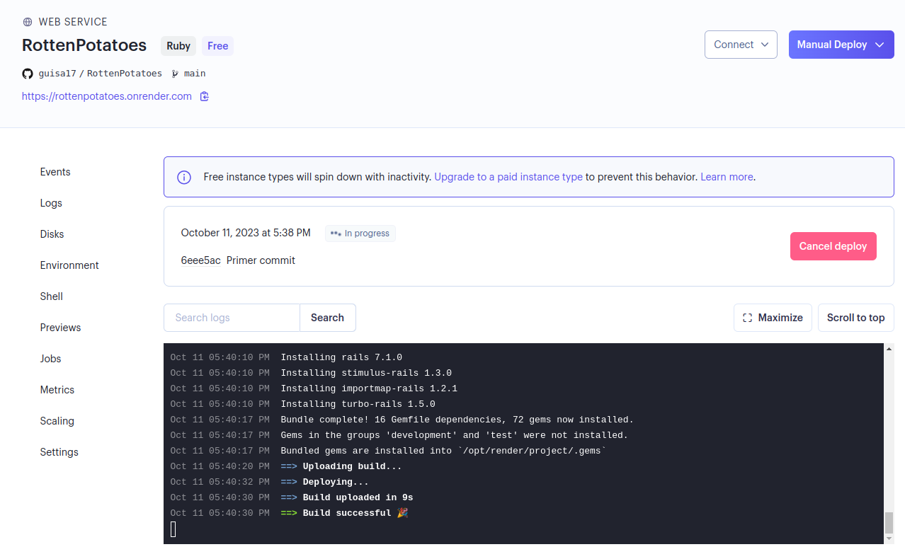

# Parte 3: Rail

### Crear una nueva aplicación Rails

Para iniciar con este apartado, creamos nuestra nueva aplicación con el siguiente comando en el terminal.

Se ha creado la carpeta rottenpotatoes, entramo en ella y ejecutamos el siguiente comando.

Alguna gemas que se han incluido en el archivo Gemfile gracias a Rails de manera automática.

Se agrega la versión de Ruby en el archivo Gemfile.

Luego, actualizamos la versión de sqlite3 escribiendo sobre el Gemfile por la siguiente:

Ahora, cuando ejecutamos bundle update, obtendremos el siguiente mensaje:

Ejecutamos la aplicación localmente.

Con todo esto y habremos creado nuestra nueva aplicación de Rail "rottepotatoes" con las configuraciones y gemas necesarias. Ahora podremos desarrollarla en las siguientes partes. 

## Base de datos en diferentes entornos

Sabemos que la base de datos de prueba se gestionan automáticamente y se reestablece en cada ejecución de prueba. Por este motivo, no se debe modificar automáticamente. 

## Crear la base de datos

De la imagen anterior, tenemos que la base de datos se almacenará en db/development.sqlite3. Además, nuestra base de datos no se generará automáticamente, podríamos pensar en crearlas manualmente; sin embargo, no es eficiente del todo.

## Crear y aplicar la migración

Una mejor alternativa al problema anterior es la migración. Como primer paso vamos a generar nuestra migración llamada create_movies, con el siguiente comando:

Ahora encontraremos el siguiente archivo en db/migrate:

En este archivo, editaremos nuestra migración, copiaremos el siguiente código:

Seguidamente, ejecutaremos el siguiente comando para poder aplicar la migración a la base de datos de desarrollo. Asimismo, prepararemos nuestra base de datos de prueba con el comando rails db:test:prepare.

Esto último nos asegurará que la base de datos de prueba tenga la misma estructura que la base de datos de desarrollo

## Crea el modelo inicial e inicializa la base de dato
Dado que las películas son un modelo, lo que se realiza a continuación es crear el modelo ActiveRecord que utiliza esta tabla. Para ello crearemos y versionaremos el archivo que se encuentra en app/models/movie.rb con lo siguiente:

Esto nos creará el modelo ActiveRecord 'Movie' que mapea la tabla de películas en la base de datos.

Luego, verificamos el modelo Movie en Rails Console de la siguiente manera:

En este entorno, crearemos una nueva instancia de Movie con atributos en blanco, y luego consultaremos el primer elemento de la base de datos con Movie.first.

A continuación, agregaremos algunos datos iniciales a nuestra base de datos en el archivo seeds.rb que se encuentra en el directorio db/.

Inmediatamente, ejecutaremos el siguiente comando para la siembra de dichos datos en la base de datos. Y consultaremos el primer elemento que tendremos en esta base de datos actualizada.

 

# Parte 4: Crear rutas, acciones y vistas CRUD para películas

Intentaremos ejecutar la aplicación nuevamente, y esta vez intentaresmos dirigirnos a /movies.

Para esta parte, queremos agregar rutas RESTful para el modelo 'Movie', lo cual configuraremos en el archivo config/routes.rb. 

Aún más importante, podremos encontrar el log en el archivo log/development.log y observamos que el mensaje de error se registra ahí.

## Crear rutas CRUD

Editaremos el archivo config/routes.rb que fue generado automáticamente. Y reemplazaremos su contenigo por el siguiente código.

Con esto estamos estableciendo rutas RESTful para el módulo 'Movie' utilizando el método resources. Además, la raíz se dirige a /movies.

Seguidamente, ejecutaremos el siguiente comando. Se nos mostrará una tabla que enumera las rutas generadas  

Volvemos a ejecutar nuestro servidor, y nos dirigiremos a /movies. Sin embargo, ahora tendremos un diferente error, pues, no ha encontrado la clase 'MoviesController'. Esto es una buena señal, ya que la ruta se ha configura correctamente y Rails está buscando al controlador.

## Crear acciones y vistas

Crearemos tanto el archivo del controlador como las vistas asociados. Empezamos ejecutando el siguiente comando:

Esto último nos generará el controlador, las vistas y las rutas necesarias para las acciones CRUD del modelo 'Movie'. Ahora tendríamos una aplicación funcional.

## Cambiar la base datos para producción

Empezaremos agregando las siguientes gemas específicas de producción. Agregamos las siguientes gemas específicas en producción en el Gemfile.

Por otro lado, moveremos la gema de sqlite3 para los grupos :development y :test y no en :production. Así se asegura que el sqlite use solo entornos de desarrollo y prueba.

Ahora que se ha modificado el Gemfile, debemos volver a ejecutar el bundle install.

Por último, se podría pensar que el archivo config/database.yml que se necesita modificar, pero no es así, la base de datos la configurará automáticamente en Heroku para utilizar Postgress. 

Se muestra el resultado de ejecutar la aplicación de manera local. Solo quedaría realizar su deployment.

## Envío

Finalmente, se realiza el deployment en render: https://rottenpotatoes.onrender.com.

