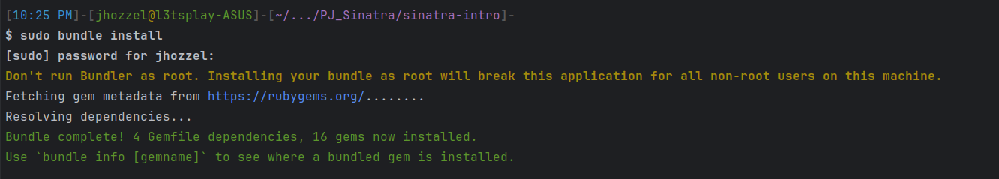
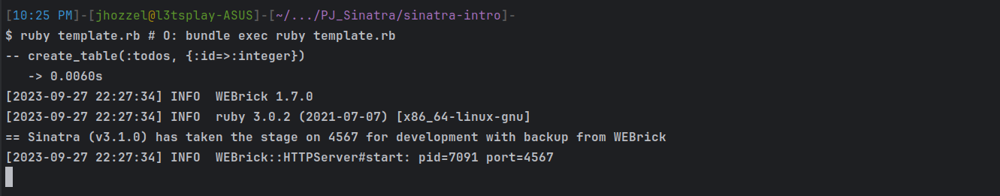
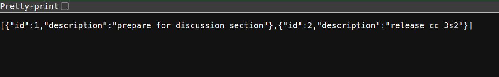
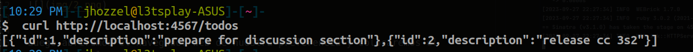

# Actividad: Demostración de MVC, rutas RESTful y CRUD con Sinatra

- Chavez Chico Joel Jhotan 20210058J
- Calagua Mallqui Jairo Andre 20210279F
- Salcedo Alvarez Guillermo Ronie 20210164D

## Ejecución de la actividad
Para empezar abriremos nuestro IDE de RubyMine y crearemos un nuevo proyecto bajo el nombre `PJ_Sinatra`, y copiamos la carpeta `sinatra-intro` dentro de esta, accedemos a dicha carpeta y ejecutamos el comando `sudo bundle install`.



Ahora bien, una vez que se ha logrado instalar exitosamente vamos a iniciar el servidor web Sinatra para acceder a la aplicación a través de nuestro navegador, para ello ejecutamos el comando: `ruby template.rb # O: bundle exec ruby template.rb`.




Luego abriremos el navegador web de nuestra preferencia y colocaremos el siguiente enlace:
```
http://localhost:4567/todos
```
Observamos que en nuestro navegador se muestra lo siguiente:




Para verificar que la aplicacion se esta ejecutando localmente y responde normalmente, hacemos un `curl` que activará una solicitud `GET` con el fin de recibir la respuesta del servidor.




## Parte 1
> Lo primero que vamos a hacer es crear un modelo. A diferencia de Rails, Sinatra no tiene MVC integrado, así que vamos a piratear el nuestro. Usaremos ActiveRecord sobre una base de datos SQLite. En esta aplicación, ¿cuál será nuestro modelo y qué operaciones CRUD le aplicaremos?


En este caso, dado que estamos trabajando con Sinatra y planeamos implementar un modelo personalizado utilizando ActiveRecord y una base de datos SQLite. Vamos a abordar operaciones CRUD

- **Index** (Listar): Muestra una lista de todos los elementos del modelo. Consulta la base de datos y muestra los registros en una vista.

```ruby
get '/todos' do
  content_type :json
  Todo.all.to_json
end
```

- **Create** (Crear): Permite a los usuarios ingresar información para crear un nuevo elemento del modelo. Los datos ingresados se utilizan para crear un nuevo registro en la base de datos.

```ruby
get '/todos/:id' do
  content_type :json
  todo = Todo.find(params[:id])
  if todo
    return {description: todo.description}.to_json
  else
    return {msg: "error: specified todo not found"}.to_json
  end
end
```


- **Read** (Leer): Muestra la información detallada de un elemento específico del modelo. Consulta la base de datos y muestra los detalles en una vista.
```ruby
post '/todos' do
  content_type :json
  todo = Todo.new(description: params[:description])
  if todo.save
    return {msg: "create success"}.to_json
  else
    return {msg: todo.errors}.to_json
  end
end
```

- **Update** (Actualizar): Permite a los usuarios editar la información de un elemento existente. Los datos editados se utilizan para actualizar el registro correspondiente en la base de datos.
```ruby
put '/todos/:id' do
  content_type :json
  id = params[:id]
  description = params[:description]

  todo = Todo.find(id)

  if todo and description != ""
    todo.update_attribute(:description, description)
    return { msg: 'update success' }.to_json
  else
    return { msg: 'update failure' }.to_json
  end
end
```

- Destroy (Eliminar): Permite a los usuarios eliminar un elemento específico del modelo. Cuando se confirma la eliminación, se elimina el registro correspondiente de la base de datos.
```ruby
delete '/todos/:id' do
  content_type :json
  id = params[:id]

  todo = Todo.find(id)

  if todo.nil?
    return { msg: 'delete failure' }.to_json
  else
    todo.destroy
    return { msg: 'delete success' }.to_json
  end
end
```
## Parte 2
**A continuación, creemos algunas rutas para que los usuarios puedan interactuar con la aplicación. Aquí hay una URL de ejemplo:**
```
https://www.etsy.com/search?q=test#copy
```
**Primero, especifica qué partes de la URL son componentes según la discusión sobre la forma de una URL. Consulta esta publicación de IBM que detalla los componentes de una URL.**


- `https://` : Protocolo de transferencia seguro utilizado para acceder al recurso.

- `etsy` : Nombre del host que identifica el servidor al que se está conectando.
- `443` : Puerto utilizado para la conexión segura a través de HTTPS.

- `/search` : Ruta o directorio en el servidor que especifica la ubicación del recurso.

- `q=test` : Consulta o parámetro de búsqueda que se pasa al servidor para procesar la solicitud.

- `copy` : Fragmento que puede ser utilizado por el navegador para posicionar la vista en una sección específica del recurso.

**En Sinatra, el enrutamiento y el controlador están acoplados, lo que facilita la declaración de rutas. Declaramos algunas rutas RESTful para que podamos ver una lista de tareas pendientes, crear una tarea pendiente, editar una tarea pendiente y eliminar una tarea pendiente. ¿Qué acciones RESTful deberíamos utilizar para estos?**

Para las rutas RESTful que estamos definiendo, podemos emplear las siguientes operaciones:

- **Listar**: Utilizamos el método GET para esta acción. Esto retorna una lista de todas las tareas pendientes.
- **Crear**: La acción RESTful para añadir una tarea pendiente es POST. Esto da lugar a la creación de una nueva tarea pendiente.
- **Editar**: Para modificar una tarea pendiente, utilizamos el método PUT en una acción RESTful. Esto actualiza una tarea pendiente que ya existe.
- **Eliminar**: La acción RESTful para suprimir una tarea pendiente es DELETE. Esto borra una tarea pendiente que ya existe.

## Parte 3
**Dado que HTTP es un protocolo RESTful, cada solicitud debe ir seguida de una respuesta, por lo que debemos devolver una vista o redirigir a cada solicitud. Usaremos JSON para las respuestas, que es similar a lo que hacen muchas API. ¿Hacia dónde debería ir la respuesta?.**


Cuando hablamos de una solicitud HTTP seguida de una respuesta, estamos describiendo el flujo de comunicación entre un cliente y un servidor a través del protocolo HTTP. En un contexto RESTful, esto implica que las operaciones que realiza el cliente (como obtener información, crear, actualizar o eliminar recursos) están asociadas con una respuesta del servidor.

En este caso, estás utilizando JSON como el formato de intercambio de datos entre el cliente y el servidor. JSON (JavaScript Object Notation) es un formato ligero y legible para intercambiar datos. Es ampliamente utilizado en aplicaciones web y es fácilmente interpretable tanto por humanos como por máquinas.
