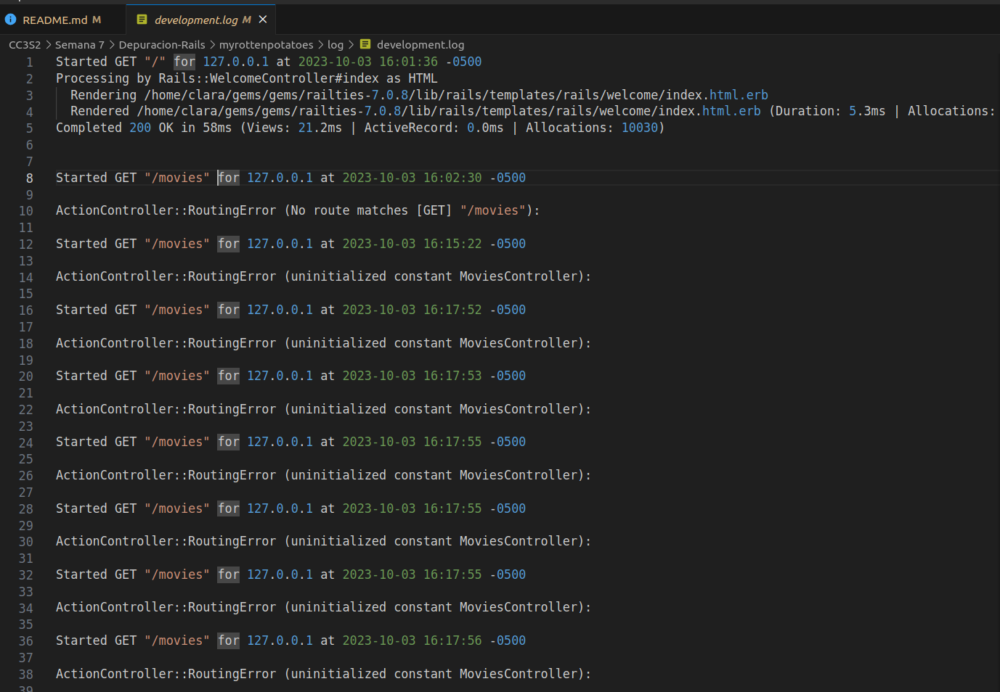
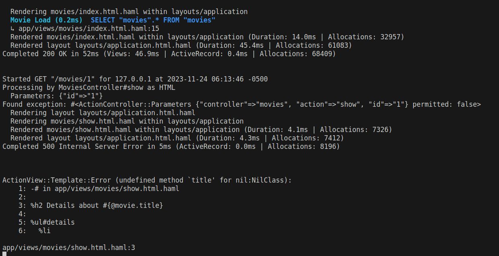
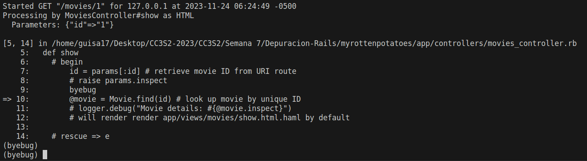

# Depuración SaaS que usan Rails

- Guillermo Ronie Salcedo Alvarez - 20210164D

En las aplicaciones SaaS que usan Rails, esta confusión se puede agravar si la operación que falló ocurre en una acción del controlador, pero el objeto inválido se pasó como una variable de instancia y luego fue dereferenciada en la vista, como se muestra en los siguientes extractos de un controlador y una vista:

```ruby
# in controller action:
def show
  @movie = Movie.find_by_id(params[:id]) # what if this movie not in DB?
  # BUG: we should check @movie for validity here!
end
-# ...later, in the Haml view:

%h1= @movie.title
-# will give "undefined method 'title' for nil:NilClass" if @movie is nil
```

Se recomienda compartir problemas en entornos de trabajo o mensajería instantánea, buscar en motores como Google y sitios especializados como StackOverflow, y, si es necesario, plantear preguntas específicas en comunidades en línea. Se destaca la importancia de la claridad y especificidad al describir problemas, proporcionando detalles como el entorno y pasos para reproducir el error.

Sin embargo, algo que podremos ir intentando si es que nuestra aplicación se detiene es lo siguiente:

Mirar el `log file` que se encuentra en `log/development.log`, para obtener una información más completa de los errores, incluyendo su traza. 



Resolver por medio de dos enfoques: el primero es insertar sentencias extra de instrumentación para registrar valores de variables importantes en varios puntos durante la ejecución del programa. 

Para ello, dentro de cualquiera de nuestras vistas incluiremos `= debug(@movie)` o `= @movie.inspect` para mostrar la descripción detallada de un objeto. Elegiremos nuestra vista `show.html.haml`:

```
-# in app/views/movies/show.html.haml

%h2 Details about #{@movie.title}

%ul#details
  %li
    Rating:
    = @movie.rating
  %li
    Released on:
    = @movie.release_date.strftime("%B %d, %Y")

%h3 Description:

= @movie.inspect 
= link_to 'Edit info', edit_movie_path(@movie)
= link_to 'Back to movie list', movies_path
```

Seguidamente, nos dirigiremos a nuestro controlador, y en el método `show`, modificamos a lo siguiente:

```ruby
def show
    begin
        id = params[:id] # retrieve movie ID from URI route
        raise params.inspect

        @movie = Movie.find(id) # look up movie by unique ID
        logger.debug("Movie details: #{@movie.inspect}")
        # will render render app/views/movies/show.html.haml by default

    rescue => e
        logger.debug("Exception: #{e.message}")
    end
end
```

A continuación, iniciamos nuestro server para poder verificar dichos cambios, y encontraremos la excepción en la línea que inicia con 'Found exception'.


Como otra manera de depurar, tenemos al depurador interactivo, el cual obtendremos a través de la gema `byebug` a través del Gemfile. Asimismo, en nuestro controlador, volveremos a modificar para `show`:

- Nota: En la guía se hace uso de la gema `debugger`; sin embargo, este ya no se usa en las versiones más actuales, y en su lugar, utilizamos `byebug`.

```ruby
def show
    id = params[:id] # retrieve movie ID from URI route
    # raise params.inspect
    byebug
    @movie = Movie.find(id) # look up movie by unique ID
    # will render render app/views/movies/show.html.haml by default
end
```
Y ejecutaremos nuestro servidor nuevamente a través de `rails server` y automáticamente se nos mostrará un prompt en la consola.


Cuando vayamos a la página, notaremos que este se encontrará en espera hasta que el depurador haya finalizado su tarea.


Finalmente, se pide comparar los archivos `config/environment/production.rb` con `development.rb`. Veremos que en `production.rb` se configuran las opciones para un entorno de producción, donde se optimice el rendimiento y la seguridad, y más importante, se establece un nivel de registro de información por medio de `config.log_level = :info`. Por otro lado, `development.rb` está diseñado para facilitar el desarrollo, por lo que se establece un nivel de registro de información `:debug` para poder proporcionar detalles más extensos durante el desarrollo.
