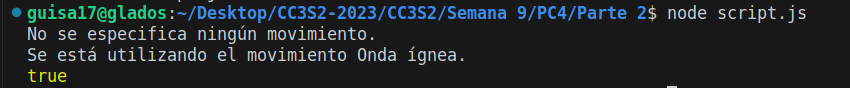

# Pregunta 2

Practicaremos la herencia y POO en JavaScript. Diseñaremos las clases Pokemon y Charizard.

Clase Pokémon:
- El constructor toma 3 parámetros (HP, ataque, defensa)
- El constructor debe crear 6 campos (HP, ataque, defensa, movimiento, nivel, tipo). Los valores de (mover, nivelar, tipo) debe inicializarse en ("", 1, "").
- Implementa un método fight que arroje un error que indique que no se especifica ningún
movimiento.
- Implementa un método canFly que verifica si se especifica un tipo. Si no, arroja un error. Si es así, verifica si el tipo incluye `flying`. En caso afirmativo, devuelve verdadero; si no, devuelve falso.

```js
class Pokemon {
    constructor(HP, ataque, defensa) {
        this.HP = HP;
        this.ataque = ataque;
        this.defensa = defensa;
        this.movimiento = "";
        this.nivel = 1;
        this.tipo = "";
    }

    fight() {
        if (!this.movimiento) {
            throw new Error("No se especifica ningún movimiento.")
        }
    }

    canFly() {
        if (!this.tipo) {
            throw new Error("No se especifica ningún.")
        }
        return this.tipo.includes('flying');
    }
}
```

Clase Charizard:
- El constructor toma 4 parámetros (HP, ataque, defensa, movimiento)
- El constructor configura el movimiento y el tipo (para "disparar/volar") además de establecer HP, ataque y defensa como el constructor de superclase.
- Sobreescribe el método fight. Si se especifica un movimiento, imprime una declaración que indique que se está utilizando el movimiento y devuelve el campo de ataque. Si no arroja un error.

```js
class Charizard extends Pokemon {
    constructor(HP, ataque, defensa, movimiento) {
        super(HP, ataque, defensa)
        this.movimiento = movimiento;
        this.tipo = "disparar/volar"
    }

    fight() {
        if (!this.movimiento) {
            throw Error("No se especifica ningún movimiento.")
        }
        console.log(`Se está utilizando el movimiento ${this.movimiento}.`)
        return this.ataque;
    }
}
```

Tendremos el siguiente ejemplo:
```js
// Ejemplo de uso
try {
    const poke = new Pokemon(100, 70, 30);
    poke.fight();
} catch(e) {
    console.log(e.message);
}

const chari = new Charizard(200, 80, 80, "Onda ígnea");
chari.fight();
console.log(chari.canFly());
```

Obtenemos los siguientes resultados:
