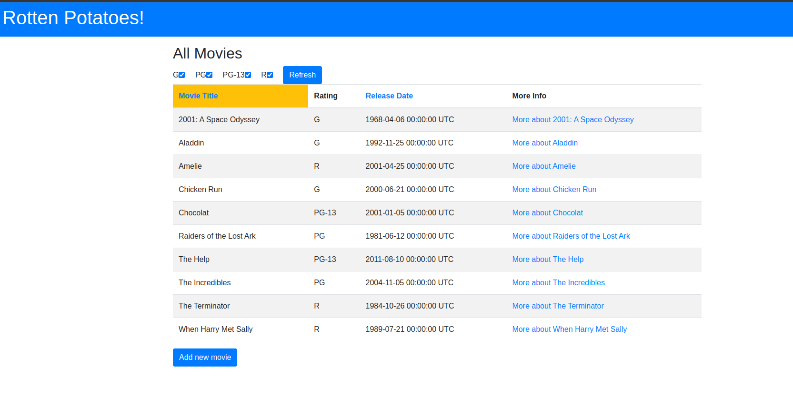
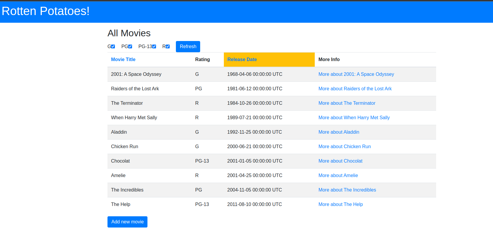
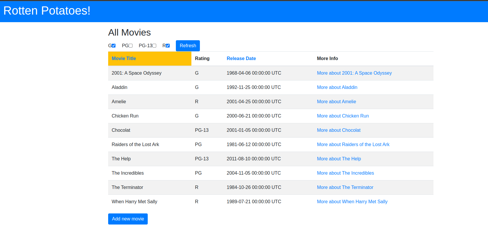
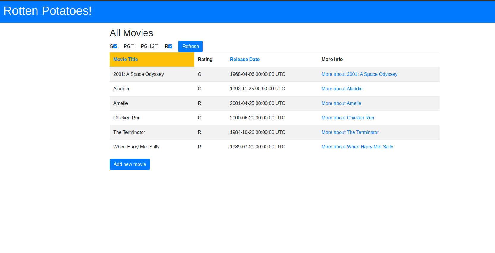

# PC3-CC3S2-Grupo10

- Palacios Sinche Breimer Paul - 20200399I
- Salcedo Alvarez Guillermo Ronie - 20210164D 
- Calagua Mallqui Jairo Andre - 20210279F

## Parte 0: Configuración inicial


**Pregunta: ¿Cómo decide Rails dónde y cómo crear la base de datos de desarrollo? (Sugerencia: verifica los subdirectorios db y config)**

En Rails, la configuración de la base de datos de desarrollo se determina a través del archivo database.yml ubicado en el directorio config. Este archivo especifica la dirección y otros detalles relevantes para la conexión a la base de datos.


**Pregunta: ¿Qué tablas se crearon mediante las migraciones?**
La migración creo la tabla movies 


Mediante la migración de db:seed se cargan datos de prueba para la base de datos


**Pregunta: ¿Qué datos de semilla se insertaron y dónde se especificaron? **
El archivo db/seed.rb nos proporciona la información que se añadirá y se cargaron mediante rake db:seed  


Verificamos, mediante el uso de rails s el correcto funcionamiento


**Uso heroku**
Inicio de sesión


Creacion de app


heroku apps:favorites:add -a su23-chips53-10
heroku git:remote -a su23-chips53-10

#Se añade el remoto 


**Ajuste para heroku**
Tenemos que modificar la configuración de heroky para que no hayan conflictos con la version 2.6.6
heroku stack:set heroku-20

**Push de nuestra rama a heroku **
Finalmente, regresa a tu rama maestra y realiza tu primera implementación de Heroku:
git checkout master
git push heroku master


## Parte 1: Filtrar la lista de películas por clasificación
#Creación de cuadros marcables
Este codigo nos permite disponer de cuadros en los que nuestras diferentes clasificación podrán ser elegidas
```ruby
<%= form_tag movies_path, method: :get, id: 'ratings_form' do %>
  <% @all_ratings.each do |rating| %>
    <div class="form-check form-check-inline">
      <%= label_tag "ratings[#{rating}]", rating, class: 'form-check-label' %>
      <%= check_box_tag "ratings[#{rating}]", "1", @ratings_to_show.include?(rating), class: 'form-check-input' %>
    </div>
  <% end %>
  <%= submit_tag 'Refresh', id: 'ratings_submit', class: 'btn btn-primary' %>
<% end %>
```
El objetivo de usar este código es poder filtrar y mostrar solo las películas seleccionadas, mediante el botón de refresh se mostrarán los cambios. El primer error que nos encontramos está en "@all_ratings" debido a que no lo hemos definido en el modelo y nos retorna una clase nula


Una solución a esto es usar un arreglo con los las clasificaciones, así cuando tengamos que mostrar las clasificaciones se podrá iterar correctamente
```ruby
def self.all_ratings
      ['G', 'PG', 'PG-13', 'R']
    end
```
Sin embargo por ahora no se está filtrando nada, necesitamos modificar el controlador para hacerlo posible

Aquí podemos obtener todas las peliculas con Movie.all_ratings o el filtro actual de la última sesión, luego será envíada a with_ratings para realizar la consulta SQL
```ruby
def index
    @all_ratings = Movie.all_ratings
    @ratings_to_show = params[:ratings] || session[:ratings] || @all_ratings

    @movies = Movie.with_ratings(@ratings_to_show)
    session[:ratings] = @ratings_to_show
  end
```
En el modelo se define with_ratings que nos mostrará todos los resultado si @ratings_to_show no tiene elementos o si es nula .Por otro lado, nos mostrará la consulta de los elementos marcados, mediante el uso de la herramienta de activeRecord: where(rating: ratings_list.keys)

```ruby
def self.with_ratings(ratings_list)
      if ratings_list.nil? || ratings_list.empty?
        all
      else
        where(rating: ratings_list.keys)
      end
    end
```  
Luego de estás modificaciones funciona correctamente el filtrado


Pregunta: ¿Por qué el controlador debe configurar un valor predeterminado para @ratings_to_show incluso si no se marca nada?
Es una buena práctica debido a que ya sea que nos evitamos valores nulos o inesperados, ya sea que no se ingrese ningún parametros siempre mostrará algo. 
Eso nos permite una buena experiencia de usuario

Pull request y push
Finalmente hacemos git checkout y push al repositorio


## Parte 2: Ordenar la lista de películas


### Configuración de los enlaces

Para la siguiente sección, se nos pide que los títulos de las columnas "Movie Title" y "Release Date" se conviertan en enlaces clickeables, tal que que al clickear en alguno de ellos, la lista de las películas se recargue y se ordene según título o fecha, respectivamente.

Para, ello nos dirigiremos a nuestro archivo `app/views/movies/index.html.erb` en donde realizaremos la siguiente modificación:

```ruby
<thead>
<tr>
    <th class="<%= 'hilite bg-warning' if session[:sort] == 'title' %>">
    <%= link_to 'Movie Title', movies_path(sort:'title'), id:'title_header' %>
    </th>
    <th>Rating</th>
    <th class="<%= 'hilite bg-warning' if session[:sort] == 'release_date' %>">
    <%= link_to 'Release Date', movies_path(sort:'release_date'), id:'release_date_header'%>
    </th>
    <th>More Info</th>
</tr>
</thead>
```
- Se ha agregado un `link_to` el cual nos creará enlaces clickeable para las columnas señaladas.
- Se ha agregado las clases `hilite bg-warning`, pertenecientes a Bootstrap, para darle formato a las columnas, si es que nuestra lista de películas está ordenada.
- Como se menciona respecto a las rutas RESTful, se hace uso del asistente de rutas `movies_path` con el parámetro `sort`, lo cual nos indica que en nuestro controlador index se encuentra la implementación del ordenamiento a través de dicho parámetro.
- Se añaden los identificadores `title` y `realease_date`


Para poder agregar la funcionalidad pedida, nos dirigiremos a nuestro archivo `app/controllers/movie_controller.rb` se realiza la siguiente lógica:

```ruby
def index
@all_ratings = Movie.all_ratings
@ratings_to_show = params[:ratings] || session[:ratings] || @all_ratings

if @ratings_to_show.is_a?(Hash)
    @ratings_to_show = @ratings_to_show.keys
end

sort_column = params[:sort]
@movies = Movie.with_ratings(@ratings_to_show).order("#{sort_column}")
session[:ratings] = @ratings_to_show
end
```
- Se realiza un condicional para verificar si nuestro argumento es un hash.
- Por medio de `sort_column` obtendremos el páremetro `sort` de la solicitud recibida. Este se establecerá cuando hagamos click sobre alguno de nuestros títulos. 
- Luego, a la línea que ya habíamos definido en la parte 1 `@movies = Movie.with_ratings(@ratings_to_show).order("#{sort_column}")` se le ha agregado el método `order` de ActiveRecord, al cual le pasaremos como parámetro qué columna debe ordenar.

Con estos cambios realizados, inciamos nuestra aplicación localmente y podremos apreciar cómo es que ahora se puede realizar el ordenamiento tan solo dando click sobre cada uno de los encabezados.

Ordenamieto de la lista de películas por nombre:


Ordenamiento de la lista de películas por fecha:



### Agregar parámetros a rutas RESTful existentes

Previamente hemos hecho uso del método `movies_path` el cual nos ayuda a generar URIs correctas para la página de índices de películas. Para nuestro caso, le hemos pasado como referencia el parámetro `sort`, en el cual se indica cómo queremos ordenar nuestra lista de películas, sea por título o por fecha. 
En otras palabras, se ha logrado que nuestros encabezados se conviertan en enlaces que al dar click, apunten a la ruta RESTful para recuperar películas, pero modificado bajo el parámetro de ordenamiento.


### Mostras las cosas en el orden correcto

Un problema que pudo llegar a desprenderse es el que, al momento de dar a `Refresh` en la página, las casillas de verificación que se han marcado se hayan olvidado. Para evitar dicho problema, simplemente se pasan al controlador dicha información (`@ratings_to_show`). 

Se muestra la página antes de darle a `Refresh`:


Luego, al dar `Refresh`, vemos cómo las casillas se mantienen, y este se encuentra ordenado según las casillas marcadas.



Finalmente, todos los cambios locales los subiremos a nuestro rama remota a través de 
```
git checkout guisa17
git status
git add .
git commit -m "se realizó un cambio"
git push origin guisa17
```


## Parte 3: Recuerda la configuración de clasificación y filtrado

Para esta parte, se procedió a agregar la Sesion que recuerda el ordenamiento:
```ruby
sort_column = params[:sort] || session[:sort]
```

Y también se procedió a agregar una línea para recordar el ordenamiento de la sesión:
```ruby
session[:sort] = sort_column
```
Pregunta: ¿Por qué se "olvida" la configuración de clasificación/filtrado de casillas de verificación cuando navegas a la página Movie Details y luego hace clic en Back to List button?.

Respuesta: Se "olvida" porque crea una nueva sesión donde no tiene memoria de lo que estaba marcado con anterioridad.

```ruby
def index
    @all_ratings = Movie.all_ratings
    @ratings_to_show = params[:ratings] || session[:ratings] || @all_ratings

    if @ratings_to_show.is_a?(Hash)
      @ratings_to_show = @ratings_to_show.keys
    end

    sort_column = params[:sort] || session[:sort] # Sesion que recuerda el ordenamiento
    @movies = Movie.with_ratings(@ratings_to_show).order("#{sort_column}")
    session[:ratings] = @ratings_to_show
    session[:sort] = sort_column  # Recuerda el ordenamiento de la sesion
  end
  ```
