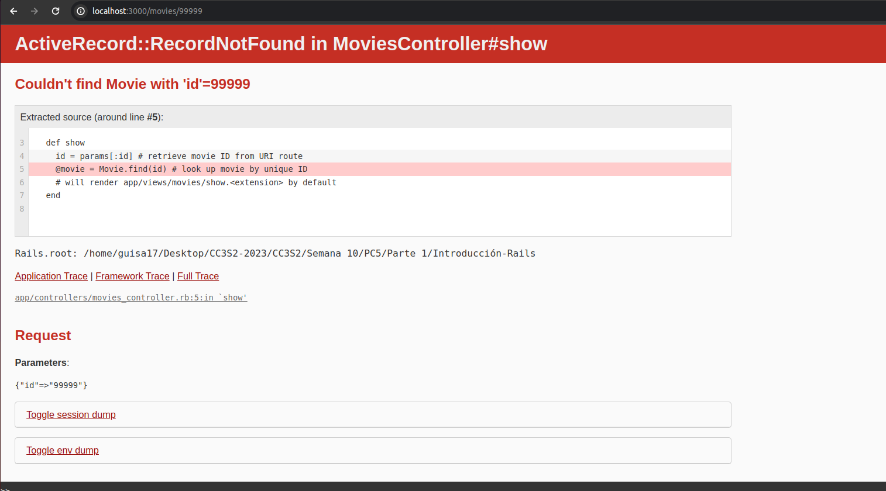
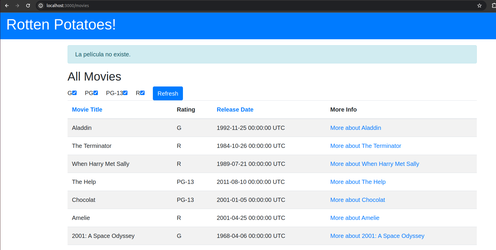
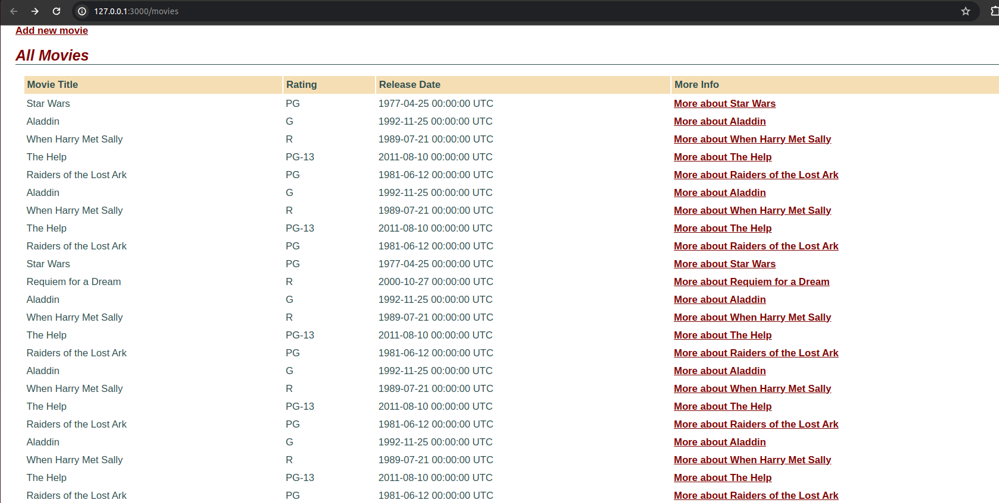

# Parte 1

## Pregunta 1
En las actividades relacionados a la Introducción de Rails los métodos actuales del controlador no son muy robustos: si el usuario introduce de manera manual un URI para ver (Show) una película que no existe (por ejemplo /movies/99999), verás un mensaje de excepción horrible. Modifica el método show del controlador para que, si se pide una película que no existe, el usuario sea redirigido a la vista Index con un mensaje más amigable explicando que no existe ninguna película con ese.

Cuando ejecutamos nuestra aplicación `rails server` e intentamos dirigirnos a `movies/99999`, nos aparecerá el siguiente error:


Para evitar dicha pantalla de error, modificaremos nuestro método `show` en nuestros controladores, tal que se nos redirija al Index con un mensaje explicando que dicha película no existe. Nuestro nuevo método será el siguiente, donde buscamos la película por medio de `find_by` (para que nos retorne nil si no se ha encontrado el id), luego, hemos agregado un condicional para el caso en el que no se encuentra la película, se nos muestra un mensaje y se nos redirecciona.

```rb
def show
    id = params[:id] # retrieve movie ID from URI route
    @movie = Movie.find_by(id: id) # look up movie by unique ID
    # will render app/views/movies/show.<extension> by default

    if @movie.nil?
        flash[:notice] = "La película no existe."
        redirect_to movies_path
    end
end
```




## Pregunta 2
En las actividades relacionados a Rails Avanzado, si tenemos el siguiente ejemplo de código que muestra cómo se integra OmniAuth en una aplicación Rails:

```rb
class SessionsController < ApplicationController
    def create
        @user = User.find_or_create_from_auth_hash(auth_hash)
        self.current_user = @user
        redirect_to '/'
        end
    protected
    def auth_hash
        request.env['omniauth.auth']
        end
    end
```

El método auth_hash  tiene la sencilla tarea de devolver lo que devuelva OmniAuth como 
resultado de intentar autenticar a un usuario. ¿Por qué piensa que se colocó esta funcionalidad 
en su propio método en vez de simplemente referenciar request.env[’omniauth.auth’] 
directamente? Muestra el uso del script.

La razón por la que se utiliza el propio método `auth_hash` para `request.env['omniauth.auth']` es porque a este se le ha agregado el `protected`, para así prever que nuestro método sea invocado por alguna ruta. Otra razón podría ser al momento de realizar pruebas, esta se podría aislar de las pruebas lógicas. Por otro lado, esto nos trae algo más de abstracción y se facilite la forma de trabajo, en donde este método sea dedicado a la autenticación indicada. 

Agregado al `sessions_controller.rb`, podemos notar que la aplicación funciona correctamente:



## Pregunta 3
En las actividades relacionados a JavaScript, Siguiendo la estrategia del ejemplo de jQuery utiliza JavaScript para implementar un conjunto de casillas de verificación (checkboxes) para la página que muestra la lista de películas, una por cada calificación (G, PG, etcétera), que permitan que las películas correspondientes permanezcan en la lista cuando están marcadas. Cuando se carga la página por primera vez, deben estar marcadas todas; desmarcar alguna de ellas debe esconder las películas con la clasificación a la que haga referencia la casilla desactivada.

# TODO


## Pregunta 4
De la actividad relacionada a BDD e historias de usuario crea definiciones de pasos que te permitan escribir los siguientes pasos en un escenario de RottenPotatoes:

```
Given the movie "Inception" exists
And it has 5 reviews
And its average review score is 3.5
```

## TODO


## Pregunta 5
De la actividad relacionadas a BDD e historias de usuario, supongamos que en RottenPotatoes, en lugar de utilizar seleccionar la calificación y la fecha de estreno, se opta por rellenar el formulario en blanco. Primero, realiza los cambios apropiados al escenario. Enumera las definiciones de pasos a partir que Cucumber invocaría al pasar las pruebas de estos nuevos pasos. (Recuerda: rails generate cucumber:install)

## TODO


## Pregunta 6

## TODO


## Pregunta 7

## TODO

