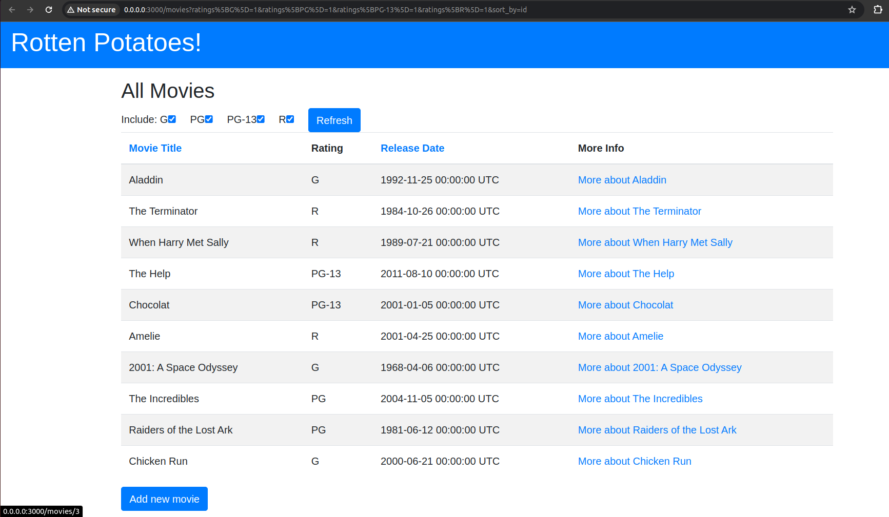
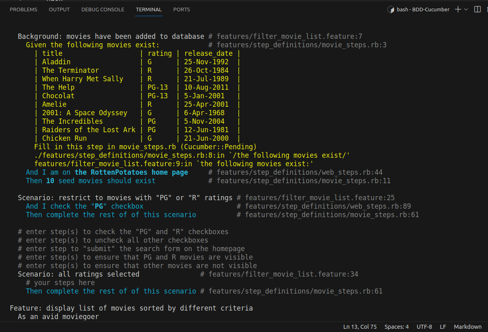

# Parte 2

Luego de haber iniciadon nuestra aplicación RottePotatoes por medio de:

```bash
cd rottenpotatoes
bundle install --without production 
bin/rake db:setup 
bin/rails server -b 0.0.0.0
```


Antes de continuar con la aplicación, ejecutaremos `bundle exec cucumber`:


Notaremos que nuestras pruebas están pendientes. Para ello, nos dirigiremos a `movie_steps.rb`, en él, empezaremos a agregar las líneas que están pendientes (`pending`), por ejemplo:

```rb
Given /the following movies exist/ do |movies_table|
  movies_table.hashes.each do |movie|
    # each returned element will be a hash whose key is the table header.
    # you should arrange to add that movie to the database here.
    Movie.create!(movie)
  end
end
```

```rb
Then /I should see "(.*)" before "(.*)"/ do |e1, e2|
  #  ensure that that e1 occurs before e2.
  #  page.body is the entire content of the page as a string.
  expect(page.body.index(e1)).to be < page.body.index(e2)
end
```

```rb
When /I (un)?check the following ratings: (.*)/ do |uncheck, rating_list|
  # HINT: use String#split to split up the rating_list, then
  #   iterate over the ratings and reuse the "When I check..." or
  #   "When I uncheck..." steps in lines 89-95 of web_steps.rb

  ratings = rating_list.split(', ')
  ratings.each do |rating|
    step %{I #{uncheck.nil? ? '' : 'un'}check "ratings_#{rating}"}
  end
end
```

```rb
Then /^I should (not )?see the following movies: (.*)$/ do |no, movie_list|
  # Take a look at web_steps.rb Then /^(?:|I )should see "([^"]*)"$/
  movies = movie_list.split(', ')
  movies.each do |movie|
    if not_see.nil?
      step %{I should see "#{movie}"}
    else
      step %{I should not see "#{movie}"}
    end
  end
end
```

```rb
Then /I should see all the movies/ do
  # Make sure that all the movies in the app are visible in the table
  Movie.all.each do |movie|
    step %{I should see "#{movie.title}"}
  end
end
```

Seguidamente, pasaremos a implementar `filter_movie_list.feature` y `sort_movie_list.feature`:

## Pregunta 1
Completa el escenario restrict to movies with PG or R ratings in filter_movie_list.feature. Puedes utilizar las definiciones de pasos existentes en web_steps.rb para marcar y desmarcar las casillas correspondientes, enviar el formulario y comprobar si aparecen las películas correctas (y, lo que es igualmente importante, no aparecen las películas con clasificaciones no seleccionadas).


