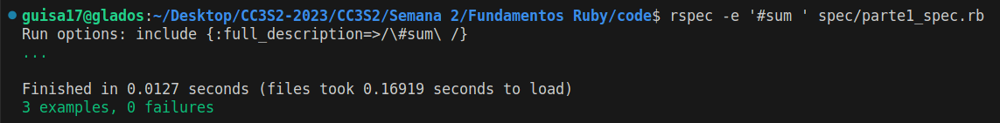
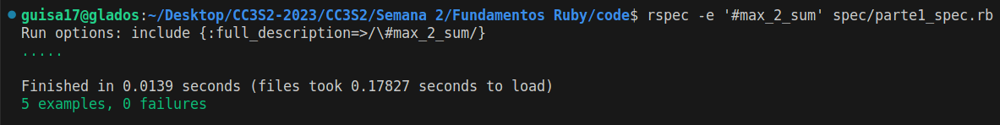

# Fundametos Ruby

- Salcedo Alvarez Guillermo Ronie - 20210164D

## Configuración de entorno

Para empezar, en nuestra carpeta crearemos los directorios `lib/` y `spec/` en donde guardaremos nuestro código y los archivos de prueba, respectivamente. Inmediatamente crearemos nuestro archivo `Gemfile` con lo siguiente:

```ruby
source 'https://rubygems.org'
gem 'rspec'
gem 'autotest', '~> 5.0'
group :development do
    gem 'guard'
end
```

Y una vez hecho esto, ejecutaremos los comandos `bundle install` para instalar las dependencias necesarias. Asimismo, se crean los archivos `spec/parte[123]_spec.rb` para realizar nuestras pruebas correspondientes a los casos de prueba que vamos a crear, estos se encuentran especificados en el repositorio de la tarea asignada.


## Parte 1: Arreglosm, hashes y enumerables

### Ejercicio 01:
Define un método `sum(array)` que tome un arreglo de números enteros como argumento y devuelva la suma de sus elementos. Para una matriz vacía, debería devolver cero.

```ruby
def sum(array):
    sum = 0
    arr.each{ |x| sum += x }
    sum
end
```

Ejecutando las pruebas asociadas obtenemos:


### Ejercicio 02:
Define un método `max_2_sum(array)` que tome un arreglo de números enteros como argumento y devuelva la suma de sus dos elementos más grandes. Para un arreglo vacío, debería devolver cero. Para un arreglo con solo un elemento, debería devolver ese elemento (considera si los dos elementos más grandes también tienen el mismo valor).

Para la resolución de este problema, ordenaremos el arreglo de mayor a menor, y simplemente se realiza la suma de los primeros dos elementos. Para los otros casos, tenemos los dos primeros condicionales:

```ruby
def max_2_sum arr
  return 0 if arr.empty?
  return arr[0] if arr.length == 1
  sorted_arr = arr.sort.reverse
  sorted_arr[0] + sorted_arr[1]
end
```

Ejecutando las pruebas asociadas obtenemos:

