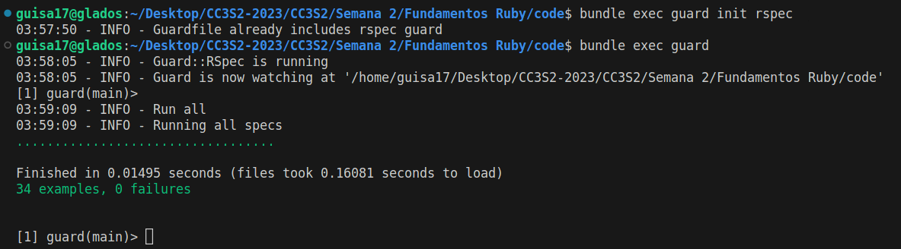

# Fundametos Ruby

- Salcedo Alvarez Guillermo Ronie - 20210164D

## Configuración de entorno

Para empezar, en nuestra carpeta crearemos los directorios `lib/` y `spec/` en donde guardaremos nuestro código y los archivos de prueba, respectivamente. Inmediatamente crearemos nuestro archivo `Gemfile` con lo siguiente:

```ruby
source 'https://rubygems.org'
gem 'rspec'
```

Y una vez hecho esto, ejecutaremos los comandos `bundle install` para instalar las dependencias necesarias. Asimismo, se crean los archivos `spec/parte[123]_spec.rb` para realizar nuestras pruebas correspondientes a los casos de prueba que vamos a crear, estos se encuentran especificados en el repositorio de la tarea asignada.


## Parte 1: Arreglos, hashes y enumerables

### Ejercicio 01:
Define un método `sum(array)` que tome un arreglo de números enteros como argumento y devuelva la suma de sus elementos. Para una matriz vacía, debería devolver cero.

```ruby
def sum(array):
    sum = 0
    arr.each{ |x| sum += x }
    sum
end
```

Ejecutando las pruebas asociadas obtenemos:


### Ejercicio 02:
Define un método `max_2_sum(array)` que tome un arreglo de números enteros como argumento y devuelva la suma de sus dos elementos más grandes. Para un arreglo vacío, debería devolver cero. Para un arreglo con solo un elemento, debería devolver ese elemento (considera si los dos elementos más grandes también tienen el mismo valor).

Para la resolución de este problema, ordenaremos el arreglo de mayor a menor, y simplemente se realiza la suma de los primeros dos elementos. Para los otros casos, tenemos los dos primeros condicionales:

```ruby
def max_2_sum arr
  return 0 if arr.empty?
  return arr[0] if arr.length == 1
  sorted_arr = arr.sort.reverse
  sorted_arr[0] + sorted_arr[1]
end
```

Ejecutando las pruebas asociadas obtenemos:


### Ejercicio 03

Define un método `sum_to_n?(array, n)` que toma un arreglo de números enteros y un número entero adicional `n`, como argumentos y devuelva verdadero si dos elementos cualesquiera en el arreglo de enteros suman `n`. `sum_to_n?([], n)` debería devolver false para cualquier valor de `n`, por definición.

Para ello, por medio del método `combintion`, le insertamos el número 2, indicando que las combinaciones se realizarán de a 2, y si encuentra una pareja en el que la suma sea `n`, nos devolverá true.


```ruby
def sum_to_n? arr, n
  return false if arr.empty?

  arr.combination(2).any? { |a, b| a + b == n }
end
```

Ejecutando las pruebas asociadas obtenemos:


Por último, podemos verificar las respuestas de todo lo anterior:


## Parte 2: Cadenas y expresiones regulares

### Ejercicio 01

Define un método hello(name) que tome una cadena que represente un nombre y devuelva la cadena "Hello", concatenada con el nombre.

```ruby
def hello(name)
  "Hello, #{name}"
end
```

Ejecutando las pruebas asociadas obtenemos:


### Ejercicio 02

Define un método `start_with_consonant?(s)` que tome una cadena y devuelva verdadero si comienza con una consonante y falso en caso contrario. Asegúrate de que funcione tanto para mayúsculas como para minúsculas y para otras letras. 

Primero verificamos para los casos en los que la cadena está vacío o el primer caracter no es una letra. Luego verificamos si es que no se encuentre en las vocales.

```ruby
def starts_with_consonant? s
  return false if s.empty? || !s[0].match?(/[a-zA-Z]/)
  !s[0].match?(/[aeiouAEIOU]/)
end
```

Ejecutando las pruebas asociadas obtenemos:


### Ejercicio 03

Define un método `binary_multiple_de_4?(s)` que tome una cadena y devuelva verdadero si la cadena representa un número binario que es múltiplo de 4, como '1000'. Asegúrate de que devuelva falso si la cadena no es un número binario válido.

Dado que buscamos múltiplos de 4, estos serán aquellos que terminen en 00, puesto que 100 es múltiplo de 4, y no importa que otros dígitos vayan a la izquierda, seguirá siendo múltiplo de 4. Por otro lado, también se debe verificar cuando la cadena es simplemente el cero, que también es múltiplo de 4.

```ruby
def binary_multiple_of_4? s
  return false unless /^[01]+$/.match(s)
  s =~ /00$/ || s == '0'
end
```

Ejecutando las pruebas asociadas obtenemos:


Por último, podemos verificar las respuestas de todo lo anterior:


## Parte 3: Conceptos básicos de orientación a objetos

Define una clase `BookInStock` que representa un libro con un número ISBN, isbn y el precio del libro como número de punto flotante, precio, como atributos.

```ruby
class BookInStock
  attr_accessor :isbn, :price
end
```

Ejecutando las pruebas asociadas obtenemos:


El constructor debe aceptar el número ISBN (una cadena, ya que en la vida real los números ISBN pueden comenzar con cero e incluir guiones) como primer argumento y el precio como segundo argumento y debe generar `ArgumentError` (una de los tipos de excepciones integradas de Ruby) si el número ISBN es la cadena vacía o si el precio es menor o igual a cero. Incluye los getters y setters adecuados para estos atributos

```ruby
class BookInStock
  attr_accessor :isbn, :price

  def initialize(isbn, price)
    return raise ArgumentError if isbn.empty? || price <= 0
    @isbn = isbn
    @price = price
  end
end
```

Ejecutando las pruebas asociadas obtenemos:


Incluye un método `price_as_string` que devuelva el precio del libro formateado con un signo de dólar inicial y dos decimales, es decir, un precio de 20 debe tener el formato $20.00 y un precio de 33.8 debe tener el formato $33.80. Consulta los métodos de cadenas formateadas en Ruby.

```ruby
class BookInStock
  attr_accessor :isbn, :price

  def initialize(isbn, price)
    return raise ArgumentError if isbn.empty? || price <= 0
    @isbn = isbn
    @price = price
  end

  def price_as_string
    format("$%.2f", @price)
  end
end
```

Ejecutando las pruebas asociadas obtenemos:


Por último, podemos verificar las respuestas de todo lo anterior:


## Algo de TDD

Para poder automatizar las pruebas realizadas podemos configurar `guard` o `autotest` con `rspec`. Tendremos que asegurar que las gemas respectivas estén instaladas, para ello, modificaremos nuestro Gemfile por el siguiente:

```ruby
source 'https://rubygems.org'
group :development do
    gem 'rspec'
    gem 'guard-rspec', require: false
end

```

Seguidamente, ejecutaremos `bundle install` para instalar las gemas necesarias. Adicionalmente, se tendrá que configurar un archivo `Guardfile` el cual ha sido agregado automáticamente, y se le ha insertado una plantilla para el uso de Guard como la siguiente, esto se logra ejecutando `bundle exec guard init rspec`.

```ruby
guard :rspec, cmd: 'bundle exec rspec' do
  # RSpec options
  watch(%r{^spec/.+_spec\.rb$})
  watch(%r{^lib/(.+)\.rb$})     { |m| "spec/lib/#{m[1]}_spec.rb" }
  watch('spec/spec_helper.rb')  { 'spec' }

  # Rails example
  watch(%r{^app/(.+)\.rb$})                           { |m| "spec/#{m[1]}_spec.rb" }
  watch(%r{^app/(.*)(\.erb|\.haml|\.slim)$})          { |m| "spec/#{m[1]}#{m[2]}_spec.rb" }
  watch(%r{^app/controllers/(.+)_(controller)\.rb$}) { |m| ["spec/routing/#{m[1]}_routing_spec.rb", "spec/#{m[2]}s/#{m[1]}_#{m[2]}_spec.rb", "spec/requests/#{m[1].singularize}_pages_spec.rb"] }
  watch(%r{^spec/support/(.+)\.rb$})                  { 'spec' }
  watch('config/routes.rb')                           { 'spec/routing' }
  watch('app/controllers/application_controller.rb')  { 'spec/controllers' }

  # Capybara features specs
  watch(%r{^app/views/(.+)/.*\.(erb|haml|slim)$})     { |m| "spec/features/#{m[1]}_spec.rb" }
end
```

Finalmente ejecutamos `bundle exec guard` para iniciar `Guard`, se nos mostrará una consola intereactiva, y si le damos a Enter, se ejecutarán todos nuestros tests:


