# Introducción a Active Record

- Guillermo Ronie Salcedo Alvarez - 20210164D

## Conceptos básicos

Para la realización de esta actividad, contamos con una base de datos con información falsa de 30 clientes. Nuestro objetivo es escribir consultas de ActiveRecord en Ruby para extraer y actualizar información de esos clientes. Haremos uso de la gema Faker para generar nombres, direcciones de correo eletrónico y fechas de nacimiento ficticias. Nuestro trabajo será completar el código `lib/activerecord_practice.rb`.


## SQL

Empezaremos ejecutando el comando `bundle` para instalar las gemas necesarias.
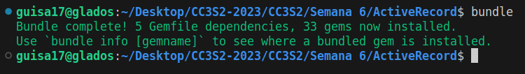

Una vez hecho esto, nos dirigiremos al archivo `activerecord_practica.rb`, y en él escribiremos código para los métodos de `Customer < ActiveRecord::Base`. Este archivo no lo ejecutaremos directamente, sino, utilizaremos el archivo de especificación (specfile). Ejecutaremos por medio de `bundle exec rspec spec/activerecord_practice_spec.rb`.

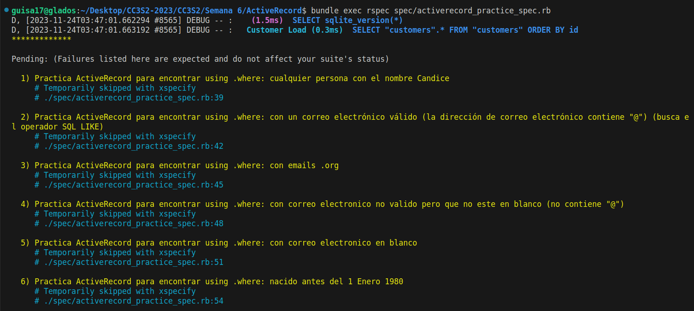
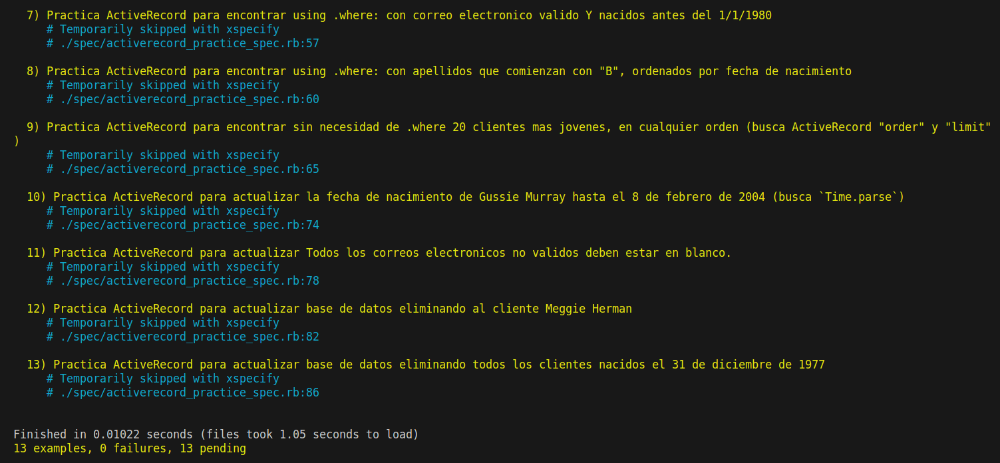

Dado que se está haciendo uso de `xspecify` en nuestro spec, estamos omitiendo todas las pruebas que no se han realizado. Para ello, cambiaremos este por `specify` y ejecutaremos nuevamente.

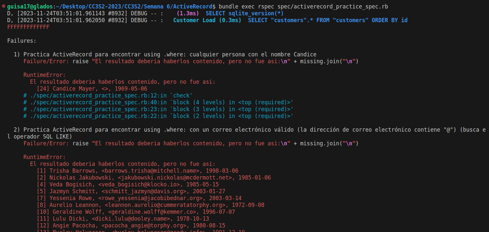

El flujo de nuestro trabajo consistirá en escribir el código necesario, aprobar la prueba, y  pasar al siguiente ejemplo.


## Automatizar el flujo de trabajo usando Guard

Para automatizar este último flujo de trabajo, utilizaremos la gema Guard, que nos elimina la necesidad de ejecutar manualmente las pruebas cada que se realiza un cambio. Guard detectará los cambias, y volverá a ejecutar las pruebas. Para poder ejecutarlo, simplemente escribiremos `guard` en el terminal, y aunque nos aparezca `guard(main)>`, no es necesario escribir nada, al realizar cualquier modificación, ya sea en el specfile o en `activerecord_practica.rb`, se ejecutará.

Al ejecutar `guard` se mostrará lo siguiente:
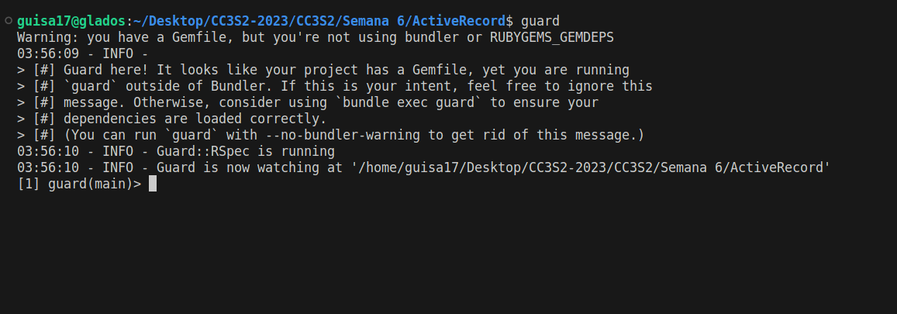

Al realizar una modificación en el specfile tendremos inmediatamente:
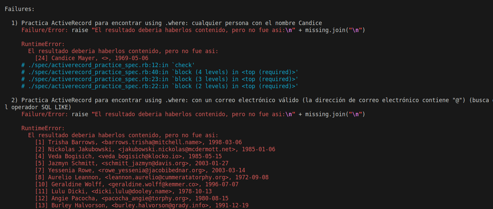


## Cómo pasar un ejemplo

Del specfile, cambiaremos aquellas líneas `xpecify` por `specify` que vayamos a implementar en nuestro código. Y una vez guardado el archivo, Guard ejecutará las pruebas automáticamente. Repetiremos esto para cada uno de nuestros ejemplos. 

Para nuestro primer caso implementado, veremos una línea en verde y el resto en amarillo:
```ruby
def self.any_candice
    Customer.where(first: 'Candice')
  end
```
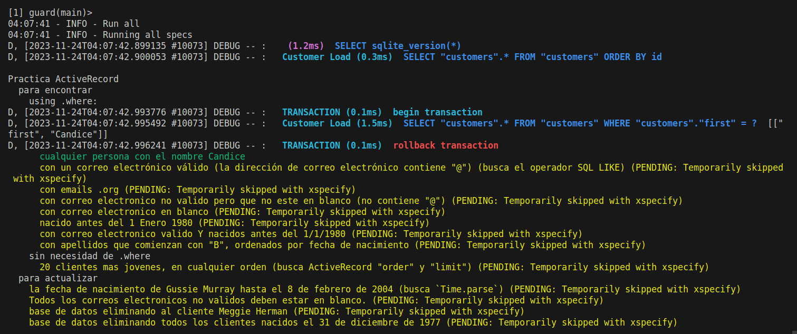

Y así iremos trabajando progresivamente:
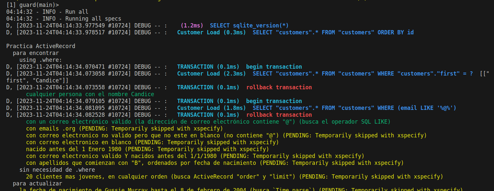

Hasta que tengamos cada uno de los ejemplos resueltos en `activerecord_practica.rb` con todas las pruebas pasadas:

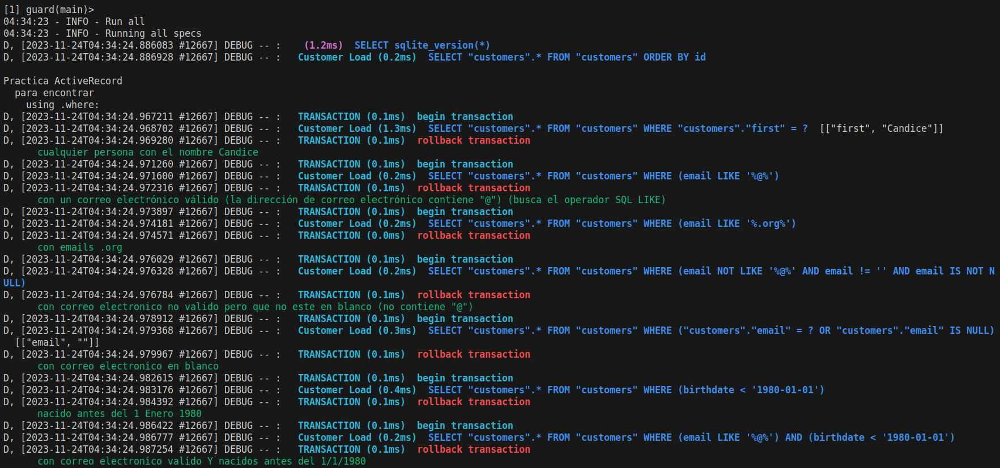
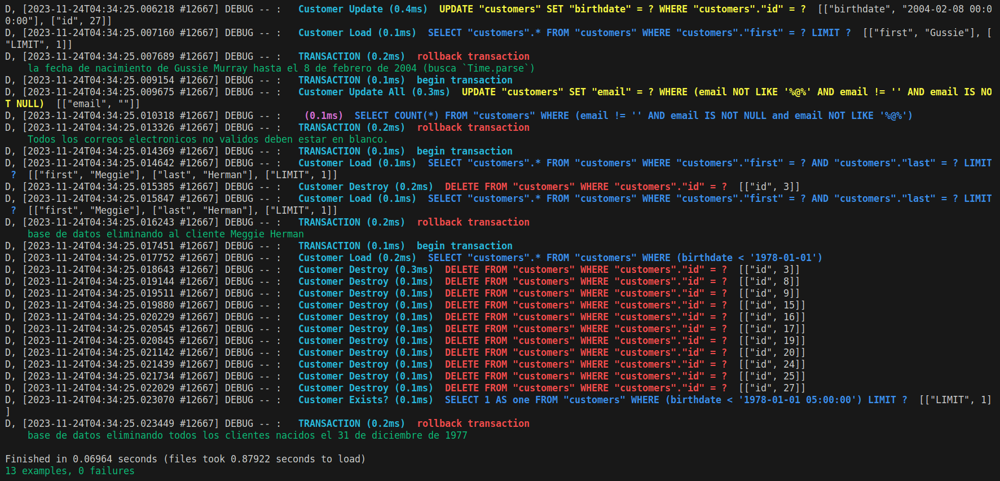

Por otro lado, si quisiéramos probar los ejemplos de forma interactiva, utilizaremos el intérpretre de Ruby con `bundle exec irb` y dentro escribiremos `load 'activerecord_practica.rb'`. Esto con el fin de definir la clase `Customer`.

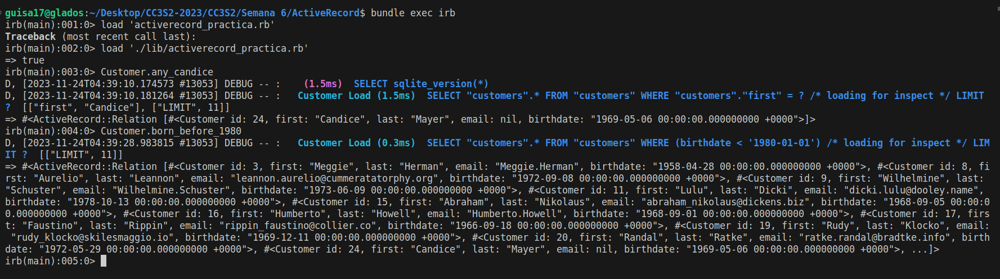
