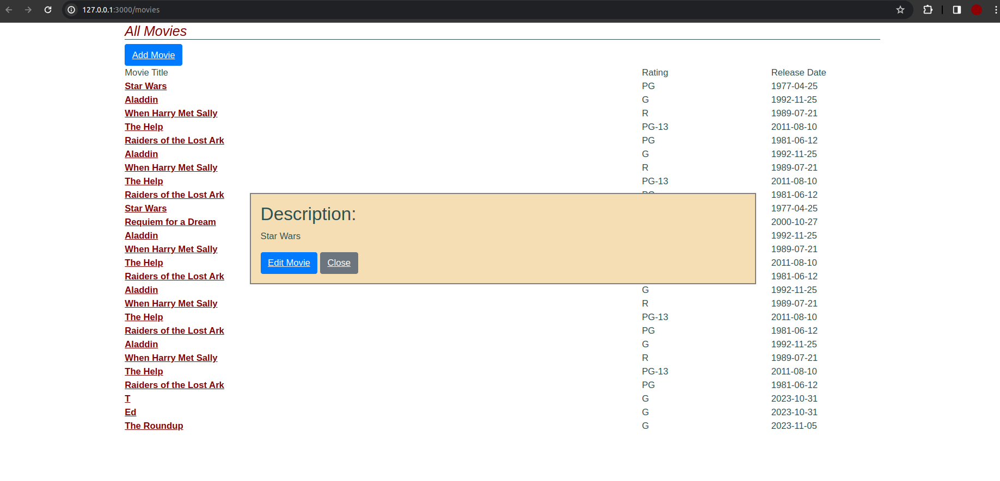

# AJAX: Asynchronous JavaScript y XML

- Guillermo Ronie Salcedo Alvarez - 20210164D

Iniciaremos con esta actividad instalando las gemas necesarias `bundle`, crear la tabla `Moviegoers` a través de `rails generate migration CreateMoviegoers` realizando la migración respectiva `rails db:migrate`.

## Parte 1

Nos dirigiremos a nuestro controlador `show` que se encuentra en `app/controllers/movies_controller.rb`, de esta manera, ya no será necesario definir una nueva ruta. Luego, crearemos nuestra vista parcial como `_movies.html.erb`.

```rb
# _movie.html.erb
<p> <%= movie.description %> </p>
<%= link_to 'Edit Movie', edit_movie_path(movie), :class => 'btn btn-primary' %>
<%= link_to 'Close', '', :id => 'closeLink', :class => 'btn btn-secondary' %>
```

Asimismo, realizamos modificaciones en el controlador:
```rb
# movies_controller.rb
def show
    id = params[:id] # retrieve movie ID from URI route
    @movie = Movie.find(id) # look up movie by unique ID
    render(:partial => 'movie', :object => @movie) if request.xhr?
    # will render render app/views/movies/show.html.haml by default
end
```

**¿Cómo sabe la acción de controlador si show fue llamada desde código JavaScript o mediante una petición HTTP normal iniciada por el usuario?**
La acción del controlador sabe si `show` fue llamada desde JavaScript o por HTTP gracias a la condición `request.xhr?`, el cual es un método que retornará `true` si la solicitud fue hecha por `AJAX` (JavaScript), luego, se nos renderizará una vista parcial.


## Parte 2
**
**¿Cómo debería construir y lanzar la petición XHR el código JavaScript?** Queremos que la ventana flotante aparezca cuando clickeamos en el enlace que tiene el nombre de la película, para ello, crearemos el archivo `movie_popup.js` en el directorio `app/assets/javascripts`, y haremos uso del siguiente bloque de código.


```js
var MoviePopup = {
  setup: function() {
    // add hidden 'div' to end of page to display popup:
    let popupDiv = $('<div id="movieInfo"></div>');
    popupDiv.hide().appendTo($('body'));
    $(document).on('click', '#movies a', MoviePopup.getMovieInfo);
  }
  ,getMovieInfo: function() {
    $.ajax({type: 'GET',
            url: $(this).attr('href'),
            timeout: 5000,
            success: MoviePopup.showMovieInfo,
            error: function(xhrObj, textStatus, exception) { alert('Error!'); }
            // 'success' and 'error' functions will be passed 3 args
           });
    return(false);
  }
  ,showMovieInfo: function(data, requestStatus, xhrObject) {
    // center a floater 1/2 as wide and 1/4 as tall as screen
    let oneFourth = Math.ceil($(window).width() / 4);
    $('#movieInfo').
      css({'left': oneFourth,  'width': 2*oneFourth, 'top': 250}).
      html(data).
      show();
    // make the Close link in the hidden element work
    $('#closeLink').click(MoviePopup.hideMovieInfo);
    return(false);  // prevent default link action
  }
  ,hideMovieInfo: function() {
    $('#movieInfo').hide();
    return(false);
  }
};
$(MoviePopup.setup);
```

La explicación de este código la dividiremos en cuatro partes:

1. `MoviePopup.setup`: Primero, crearemos un `div` escondido con el id `MovieInfo`, en donde se mostrará la descripción de la película en la que hagamos click. Dicho elemento, se agregará al final de nuestro `body` (`.appendTo`). Finalmente, establecemos que al hacer click sobre los elemento con id `#movies`, llamaremos al método `getMovieInfo`.

2. `getMovieInfo`: Realizaremos una solicitud AJAX (`$.ajax`) de tipo `get` hacia el enlace al que se hizo click. Si nuestra solicitud tiene éxito, se llama al método `showMovieInfo`; de lo contrario, se muestran los mensajes de error.

3. `showMovieInfo`: Nos encargaremos de mostrar la información, para ello, primero calculamos las dimensiones del popup y lo centramos en la ventana. Y llenaremos con los datos recibidos `data`. Por otro lado, se establece que al hacer click sobre un elemento con id `closeLink`, llamaremos al método `hideMovieInfo`.

4. `hideMovieInfo`: Este método oculta el popup de la ventana por medio de `.hide()`.


Adicionalmente, agregaremos el siguiente bloque de `CSS` para especificar la posición absoluta de nuestro popup. Agregaremos lo siguiente en `app/assets/stylesheet/application.css`:

```css
#movieInfo {
  padding: 2ex;
  position: absolute;
  border: 2px double grey;
  background: wheat;
}
```

Algunos detalles que han de considerarse para que se muestre de manera correcta el popup en nuestra aplicación son las siguiente:

- Actualizaremos nuestra vista de aplicación `app/views/layouts/application.html.erb`, tal que deberíamos tener lo siguiente:

    ```html
    <head>
    <title> RottenPotatoes! </title>
    <link rel="stylesheet" href="https://getbootstrap.com/docs/4.0/dist/css/bootstrap.min.css">
    <%= javascript_include_tag 'https://code.jquery.com/jquery-3.6.4.min.js' %>
    <%= stylesheet_link_tag 'application', media: 'all', 'data-turbolinks-track': 'reload' %>
    <%= javascript_include_tag :application %>
    <%= csrf_meta_tags %>
    <%= javascript_include_tag 'movie_popup' %>
    </head>
    ```

- Nuestra vista parcial ha sido modificada de la siguiente manera, con el fin de que al clickear sobre algún título, también se muestre el título al que nos estamos refiriendo:


  ```html
  <!-- app/views/movies/_movie.html.erb -->
  <div>
      <h2>Description: </h2>
      <p><%= @movie.title %></p>
      <p><%= @movie.description %></p>
  </div>

  <%= link_to 'Edit Movie', edit_movie_path(@movie), class: 'btn btn-primary' %>
  <%= link_to 'Close', '', id: 'closeLink', class: 'btn btn-secondary' %>
  ```

- En nuestra vista `show ` se ha agregado la siguiente línea `<%= render partial: 'movie', locals: { movie: @movie } %>`, tal que, cuando nos dirijamos a este, se nos renderizará la vista parcial en su lugar.

- Finalmente, en nuestra archivo `manifest.js` que se encuentra en `app/assets/config`, agegaremos la siguiente línea `//= link movie_popup.js`, con el fin de que nuestro archivo `movie_popup.js` que hemos creado hace poco, se vuelva activo y sea procesado en nuestra aplicación.


Al ejecutar nuestro servidor `rails server`, obtendremos el siguiente resultado al clickear sobre el enlace de la película `Star Wars`:

Actualmente, nuestra base de datos no posee los datos de descripción, por este motivo es que no se muestra descripción alguna.


## Parte 3

Una advertencia a considerarse al usar JavaScript para crear nuevos elementos dinámicamente en tiempo de ejecución es cuando registramos un manejadador de eventos con `$(.myClass).on('click', func)`, pues, este solo se aplicará a los elementos existentes que coincida con `myClass` al momento de la llamada inicial. Sin embargo, si se crean nuevos elementos con `myClass` después de la carga inicial y de la llamada inicial, no serán considerados en el manejador de eventos, ya que `on` solo puede asociar manejadores a elementos que existen en ese momento.

**¿Cuál es solución que brinda jQuery a este problema?**

  Para resolver este problema, con `jQuery`. a través del uso de delegación de eventos `on()`, emplearemos la siguiente línea en su lugar:

  ```js
  $document.on('click', '.myClass', func)
  ```

De esta manera, estamos delegando el manejo de eventos al documento, tal que se asegura que en cualquier futuro que coincida con `myClass`, también se activará el manejador de eventos. Eso resulta útil en aplicaciones web interactivas donde se generan o modifican elementos en respuestas a acción del usuario.
