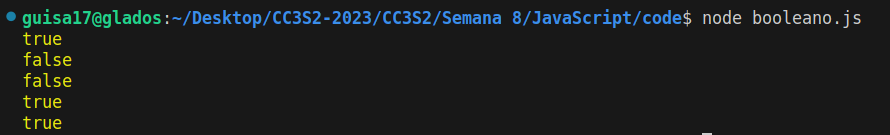
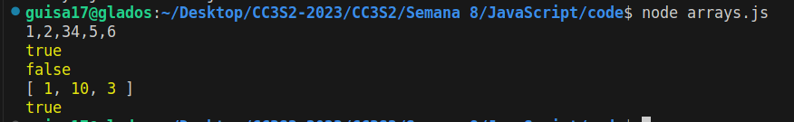
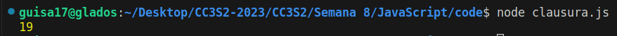
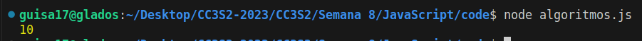
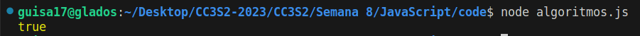
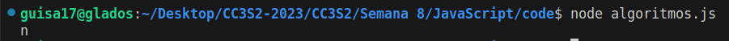
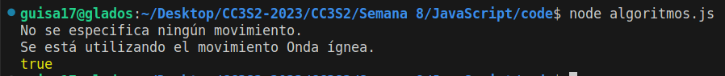

# JavaScript

- Guillermo Ronie Salcedo Alvarez - 20210164D

La comunidad de JavaScript ha florecido en los últimos años y frameworks como React y Node.js hacen posible escribir aplicaciones completas en JavaScript. Nos centraremos principalmente en el lenguaje JavaScript, AJAX, DOM y Eventos/Callback.

## Preguntas conceptuales

- **En JavaScript, todas las operaciones de red son asíncronas. ¿Por qué es esto importante?**

    La asincronía en JavaScript es importante para garantizar que las operaciones de red no bloqueen la ejecución del programa. Un claro ejemplo son las solicitudes HTTP. La asicronía nos permite que el programa continúe ejecutándose mientras espera respuestas, mejorando la eficiencia y capacidad de respuesta de las aplicaciones web.


- **En Javascript, queremos realizar acciones tras una operación/solicitud de red completa. ¿Qué paradigma de programación hace esto posible?**

    El paradigma de JavaScript utiliza para realizar acciones tras una operación/solicitud es el paradigma de programación basado en eventos o asíncrono. Por medio de callbacks, promesas y async/await es posible ejecutar código después de que se completa una operación de red.


- **¿Javascript proporciona soporte limitado para la herencia a través de qué mecanismo?**

    JavaScript proporciona la herencia mediante prototipos, cada objeto hereda propiedades y métodos de un prototipo, permitiendo la creación de cadenas de prototipos para compartir comportamientos entre objetos.


- **¿Qué es el DOM? ¿Qué librería nos ayuda a usar Javascript para manipular el DOM?**

    El DOM (*Document Object Model*) es una interfaz que representa la estructura de un documento HTML o XML. La librería que nos ayuda a manipular el DOM es `jQuery`, el cual facilita manipulación del DOM a través de métodos abreviados y funciones para trabajar con la estructura e interactividad del documento de manera sencilla.


## ¿Qué puede hacer JavaScript?

JavaScript comparte el paradigma "todo es un objeto" con Ruby, con algunas excepciones notables. Su lista de primitivas incluye `String`, `Number`, `undefined`, `null`, `Boolean` y `BigInt`. Al igual que en Ruby, los valores se escriben dinámicamente, utilizando `var` o `let` para declarar variables en lugar de tipos. A pesar de estas similitudes, JavaScript tiene idiosincrasias únicas que impactan la codificación efectiva. 

### Booleano

Debido a la flexibilidad en la escritura dinámica de variables en JavaScript, algunos valores evalúan como Verdadero/Falso al convertirse en booleanos, pero al compararse entre sí, pueden dar resultados inesperados. Para realizar dichas comparaciones, tenemos el siguiente script:

```js
console.log(undefined == null);
console.log(NaN == NaN);
console.log(null == false);
console.log(0 == false);
console.log("" == false);
```

Los resultados obtenidos son los siguientes:


- `undefined == null` es `true` debido a que ambos representan valor nulo y son tratados iguales en comparaciones estrictas `===`. 

- `Nan == Nan` es `false` debido a que `NaN` (*Not a Number*) nunca será igual a otro `NaN`.

- `null == false` es `false` debido a que estos son diferentes en comparación estricta `===`, además se tiene así por definición en JavaScript.

- `0 == false` es `true` debido a que al realizar la conversión booleana, todos los booleanos se convertirán en `true`, a excepcioń del `0` que se convertirá en `false`.


- `"" == false` es `true` debido a que la cadena vacía se convertirá en `0` y `false` se convierte en `0`.


### Arrays

A continuación se presentan casos de cómo se comportan los arrays en JavaScript.

```js
arr1 = [1, 2, 3] + [4, 5, 6]
arr2 = !![]
arr3 = [10, 1, 3].sort()

console.log(arr1)
console.log(arr2)
console.log([] == true)
console.log(arr3)
console.log([] == 0)
```




- `[1, 2, 3] + [4, 5, 6]` obtenemos `1, 2, 34, 5, 6` porque lo que se está haciendo es que los elementos de los arreglos se convierten en string y son concatenados.

- `!![]` obtenemos `true` porque, aunque nuestro array esté vacío, este es un objeto y se tomará como verdadero.

- `[] == true` obtenemos `false` porque en comparaciones no estrictas, el arreglo vacío se convertirá en `0`, y `true` se convierte en `1`.

- `[10, 1, 3].sort()` obtenemos impreso el arreglo `[1, 10, 3]` ordenado; sin embargo, será según orden lexicográfico.

- `[] == 0` será `true` debido a que en comparaciones no estrictas, nuestro arreglo vacío se convierte en `0`.


### Clausuras

En JavaScript, las clausuras son una técnica popular que combina funciones con referencias a su entorno circundante. Funcionan como funciones de orden superior en Python, permitiendo que una función interna acceda al alcance de una función externa incluso después de que la función externa haya finalizado. Sea nuestro ejemplo:

```js
function f1(x) {
  var baz = 3;
  return function (y) {
    console.log(x + y + (baz++));
    }
}
var bar = f1(5);
bar(11);
```

Cuyo resultado será:


Este resultado se obtiene dado que iniciamos llamando a `f1(5)`, con lo que tendremos `x = 5` y se inicializa `baz = 3`. Luego, en la última línea, llamamos a `bar(11)`, por lo que tendremos `y = 11`. Finalmente, en consola se imprimirá el resultado de `x + y + baz++ = 5 + 11 + 3 = 19`, y en la siguiente llamada, `baz` será 4.


### Algoritmos

Reescribiremos la siguiente que encuentra el mayor elemento de un array de complejidad `O(n²)` a `O(n)`.

```js
function greatestNumber(array) {
  for (let i of array) {
    let isIValTheGreatest = true;
    for (let j of array) {
      if (j > i) {
        isIValTheGreatest = false;
      }
    }
    if (isIValTheGreatest) {
      return i;
    }
  }
}
```

La lógica que seguiremos para reducir la complejidad será introducir una variable temporal en la que se almacene el máximo valor encontrado, este valor se irá actualizando con cada elemento que hayamos recogido. Una vez hayamos recorrido todo el arreglo, habremos encontrado el máximo elemento.

```js
function greatestNumber(array) {
    let max = array[0];
    for (let i of array) 
    {
        if (i > max) {
            max = i;
        }
    }
    return max;
}
```

Sea nuestro ejemplo el siguiente:
```js
console.log(greatestNumber([2, 4, 5, 6, 10, 8]));
```



Sea la siguiente función que realiza la búsqueda de `x` en un string. Veremos que su complejidad es de `O(n)`, pues recorre todo el arreglo; sin embargo, podemos optimizarla, de manera que, apenas encuentre `x` se termine la búsqueda.
```js
function containsX(string) {
    foundX = false;
    for(let i = 0; i < string.length; i++) {
        if (string[i] === "X") {
            foundX = true;
        }
    }
    return foundX;
  }
```
La función optimizada será de la siguiente forma:

```js
function containsX(string) {
    for (let s of string) {
        if (s == 'X') {
            return true;
        }
    }
    return false;
}
```

Sea nuestro ejemplo el siguiente:
```js
console.log(containsX('Los archivos X'));
```



Por último, escribiremos una función que devuelva el primer carácter no duplicado de una cadena. Para ello, primero tendremos que hallar las frecuencias de cada una de las letras en un diccionario, esto sería `O(n)`, y luego, de los elementos del diccionario, el primer elemento que tenga una frecuencia de 1 será el primer carácter no dupilicado, y retornamos. Este último paso también es `O(n)`, y al sumar las complejidades, nos quedaríamos con un algoritmo `O(n)`.

```js
function firstDuplicate(string) {
    // Diccionario para las frecuencias
    let freq = {}
    for (let s of string) {
        // Verificamos si ya tenemos algún elemento para freq
        // de lo contrario, será 0
        freq[s] = (freq[s] || 0) + 1;
    }

    for (let s of string) {
        if (freq[s] == 1) {
            return s;
        }
    }
    return 'Not found';
}
```

Sea nuestro ejemplo el siguiente:
```js
console.log(firstDuplicate('minimum'));
```



### Clases

Diseñaremos las clases `Pokemon` y `Charizard`. 

Sea la clase `Pokemon` que requiere: 
- El constructor toma 3 parámetros (HP, ataque, defensa)
- El constructor debe crear 6 campos (HP, ataque, defensa, movimiento, nivel, tipo). Los valores de (mover, nivelar, tipo) debe - inicializarse en ("", 1, "").
- Implementa un método flight que arroje un error que indique que no se especifica ningún movimiento.
- Implementa un método canFly que verifica si se especifica un tipo. Si no, arroja un error. Si es así, verifica si el tipo incluye "volar". En caso afirmativo, devuelve verdadero; si no, devuelve falso.

```js
class Pokemon {
    constructor(HP, ataque, defensa) {
        this.HP = HP;
        this.ataque = ataque;
        this.defensa = defensa;
        this.movimiento = "";
        this.nivel = 1;
        this.tipo = "";
    }

    flight() {
        if (!this.movimiento) {
            throw new Error("No se especifica ningún movimiento.")
        }
    }

    canFly() {
        if (!this.tipo) {
            throw new Error("No se especifica ningún.")
        }
        return this.tipo.includes('volar');
    }
}
```


Sea la clase `Charizard` que requiere:
- El constructor toma 4 parámetros (HP, ataque, defensa, movimiento)
- El constructor configura el movimiento y el tipo (para "disparar/volar") además de establecer HP, ataque y defensa como el constructor de superclase.
- Sobreescribe el método fight. Si se especifica un movimiento, imprime una declaración que indique que se está utilizando el movimiento y devuelve el campo de ataque. Si no, arroja un error.


```js
class Charizard extends Pokemon {
    constructor(HP, ataque, defensa, movimiento) {
        super(HP, ataque, defensa)
        this.movimiento = movimiento;
        this.tipo = "disparar/volar"
    }

    flight() {
        if (!this.movimiento) {
            throw Error("No se especifica ningún movimiento.")
        }
        console.log(`Se está utilizando el movimiento ${this.moviemiento}.`)
        return this.ataque;
    }
}
```

Sean nuestro ejemplos de uso los siguientes:
```js
try {
    const poke = new Pokemon(100, 70, 30);
    poke.fight();
} catch(e) {
    console.log(e.message);
}

const chari = new Charizard(200, 80, 80, 'Onda ígnea');
chari.fight();
console.log(chari.canFly());
```


