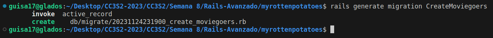
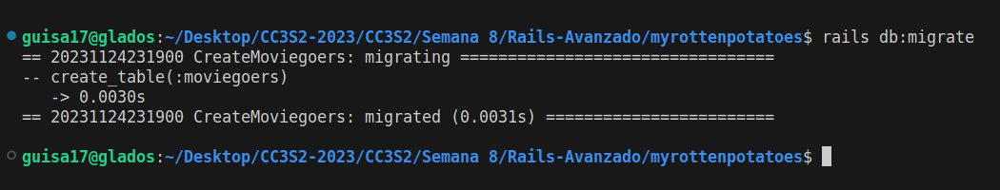
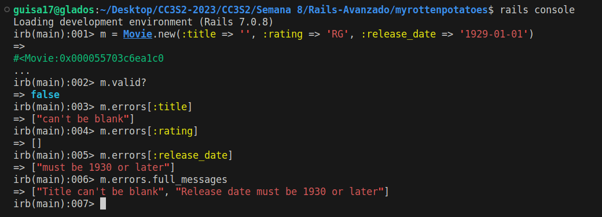
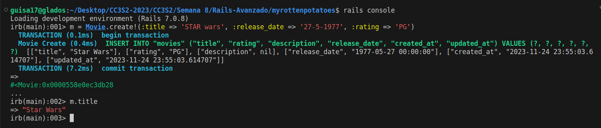
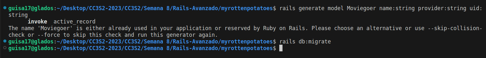

# Ruby on Rails avanzado

- Guillermo Ronie Salcedo Alvarez - 20210164D

## Vistas parciales, validaciones y filtros

Una vista parcial es el nombre de Rails para una parte reutilizable de una vista. Por ello, crearemos un nuevo archivo `_movie.html.erb` para diferenciarlo como vista parcial, el cual lo guardaremos en el directorio `app/views/movies`. En él, escribiremos el siguiente código:

```html
<div class="row">
    <div class="col-8"> <%= link_to movie.title, movie_path(movie) %> </div>
    <div class="col-2"> <%= movie.rating %> </div>
    <div class="col-2"> <%= movie.release_date.strftime('%F') %> </div>
</div>
```

Sabemos que Rails usará el nombre del archivo (sin el guion bajo) para establecer una variable local (movie) para cada elemento de la colección `@movies`.

Seguidamente, en el archivo `app/models/movie.rb` ajduntaremos el código dado:

```ruby
class Movie < ActiveRecord::Base
    def self.all_ratings ; %w[G PG PG-13 R NC-17] ; end #  shortcut: array of strings
    validates :title, :presence => true
    validates :release_date, :presence => true
    validate :released_1930_or_later # uses custom validator below
    validates :rating, :inclusion => {:in => Movie.all_ratings},
        :unless => :grandfathered?
    def released_1930_or_later
        errors.add(:release_date, 'must be 1930 or later') if
        release_date && release_date < Date.parse('1 Jan 1930')
    end
    @@grandfathered_date = Date.parse('1 Nov 1968')
    def grandfathered?
        release_date && release_date < @@grandfathered_date
    end
end
```

A continuación, para poder comprobar nuestros resultados en consola, debemos realizar nuestra migración, empezaremos generando nuestro archivo de migración.
```bash
$ rails generate migration CreateMoviegoers
```



Podremos encontrar en `db/migrate` el siguiente bloque de código:

```ruby
class CreateMoviegoers < ActiveRecord::Migration[7.0]
  def change
    create_table :moviegoers do |t|

      t.timestamps
    end
  end
end
```

Ahora, ya podremos ejecutar nuestra migración por medio de:
```bash
$ rails db:migrate
```


Con esto realizado, ya podremos verificar nuestros resultados en la consola:



Luego, se nos pide explicar el siguiente bloque de código, que se encuentra en `app/controllers/movies_controller.rb`:

```ruby
class MoviesController < ApplicationController
  def new
    @movie = Movie.new
  end 
  def create
    if (@movie = Movie.create(movie_params))
      redirect_to movies_path, :notice => "#{@movie.title} created."
    else
      flash[:alert] = "Movie #{@movie.title} could not be created: " +
        @movie.errors.full_messages.join(",")
      render 'new'
    end
  end
  def edit
    @movie = Movie.find params[:id]
  end
  def update
    @movie = Movie.find params[:id]
    if (@movie.update_attributes(movie_params))
      redirect_to movie_path(@movie), :notice => "#{@movie.title} updated."
    else
      flash[:alert] = "#{@movie.title} could not be updated: " +
        @movie.errors.full_messages.join(",")
      render 'edit'
    end
  end
  def destroy
    @movie = Movie.find(params[:id])
    @movie.destroy
    redirect_to movies_path, :notice => "#{@movie.title} deleted."
  end
  private
  def movie_params
    params.require(:movie)
    params[:movie].permit(:title,:rating,:release_date)
  end
end
```

El siguiente código, referente al controlador, nos establece los métodos a llevar a cabo.
- `new`: Inicializa una nueva instancia de clase y la asigna una variable para luego construirlo.
- `create`: Crea una nueva película con los parámetros dados. Luego, redigirá a la lista de películas si la creación ha sido exitosa; de lo contrario, muestra un mensaje de error.
- `edit`: Recupera una película según el id proporcionado, asigna la película a la variable de instancia `@movie`.
- `update`: Actualiza una película existente con los parámetros proporcionados en el formulario de edición. Si la actualización es exitosa, redirige a la página de detalles de la película con un mensaje de éxito. Si hay errores en la actualización, muestra un mensaje de error y vuelve a renderizar el formulario de edición.
- `destroy`: Busca y carga las películas existentes con el id proporcionado, después lo elimina.
- `movie_params`: Utilizado para encapsular los parámetros permitidos para los operaciones de creación y actualización de películas.

Seguidamente, ilustraremos el método de "canonicalizar". Nos dirigimos al archivo `movie.rb`
```ruby
class Movie < ActiveRecord::Base
    before_save :capitalize_title
    def capitalize_title
        self.title = self.title.split(/\s+/).map(&:downcase).
        map(&:capitalize).join(' ')
    end
end
```

Y en la consola comprobaremos lo siguiente:


Vemos que a pesar de haber "escrito mal" Star Wars, se ha modificado de manera exitosa.

Nos dirigimos al área de filtros de nuestra app Rails. Los filtros de controlador son métodos que evalúan condiciones antes de ejecutar una acción, estableciendo condiciones comunes para varias acciones o deteniendo la presentación si las condiciones no se cumplen. Si el filtro permite que la acción continúe, es responsabilidad de la acción proporcionar una respuesta.

Destacaremos el uso común de los filtros para imponer requisitos, como la necesidad de que un usuario inicie sesión antes de realizar ciertas acciones. El código proporciona un ejemplo de un filtro que verifica si un usuario válido ha iniciado sesión. Si el usuario no está autenticado, el filtro redirige al usuario a la página de inicio de sesión, como el que se muestra:

```ruby
class ApplicationController < ActionController::Base
    before_filter :set_current_user
    protected # prevents method from being invoked by a route
    def set_current_user
        # we exploit the fact that the below query may return nil
        @current_user ||= Moviegoer.where(:id => session[:user_id])
        redirect_to login_path and return unless @current_user
    end
end
```

Notamos cómo nuestro filtro hace uso de `set_current_user` que se ejecuta antes de cualquier controlador. El cual asegura que haya un usuario autenticado. Por otro lado, el filtro hará consultas a la base de datos para obtener el usuario actual basado en la sesión del usuario.


## SSO y autenticación a través de terceros


Para este apartado, crearemos un modelo y una migración usando el siguiente comando y haremos uso de `rails db:migrate` para la migración.

a) Creamos el modelo `moviegoers` y su migración respectiva.


b) Editamos el código `app/models/moviegoer.rb` de la siguiente manera:

```ruby
# Edit app/models/moviegoer.rb to look like this:
class Moviegoer < ActiveRecord::Base
    def self.create_with_omniauth(auth)
        Moviegoer.create!(
        :provider => auth["provider"],
        :uid => auth["uid"],
        :name => auth["info"]["name"])
    end
end
```
Seguidamente, realizaremos la autenticación de usuario a través de un tercero. Usaremos la gema OmniAuth que proporciona una API uniforme para muchos proveedores de SSO diferentes. El código siguiente muestra los cambios necesarios en sus rutas, controladores y vistas para usar OmniAuth:

```ruby
#routes.rb
get  'auth/:provider/callback' => 'sessions#create'
get  'auth/failure' => 'sessions#failure'
get  'auth/twitter', :as => 'login'
post 'logout' => 'sessions#destroy'
```

```ruby
# Creamos el archivo sessions_controller.rb
class SessionsController < ApplicationController
  # login & logout actions should not require user to be logged in
  skip_before_filter :set_current_user  # check you version
  def create
    auth = request.env["omniauth.auth"]
    user =
      Moviegoer.where(provider: auth["provider"], uid: auth["uid"]) ||
      Moviegoer.create_with_omniauth(auth)
    session[:user_id] = user.id
    redirect_to movies_path
  end
  def destroy
    session.delete(:user_id)
    flash[:notice] = 'Logged out successfully.'
    redirect_to movies_path
  end
end
```