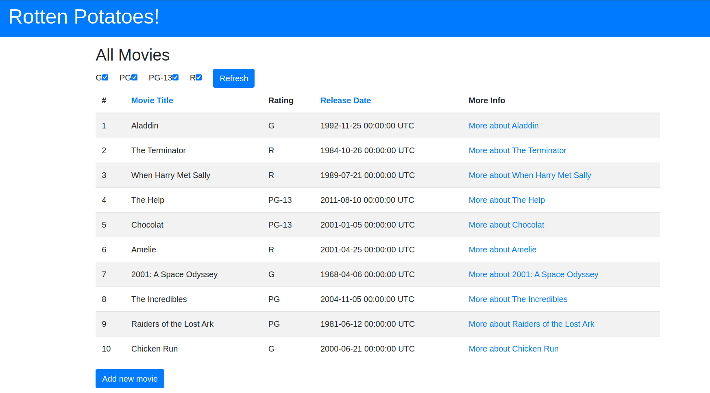
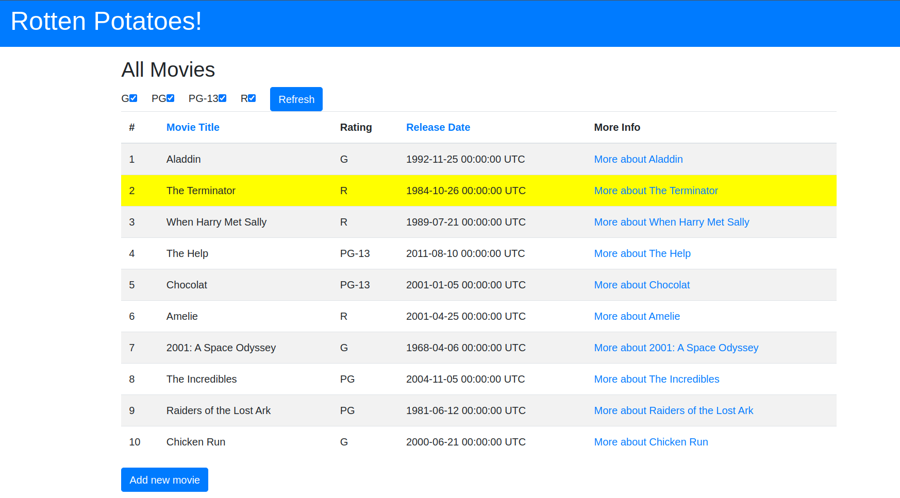
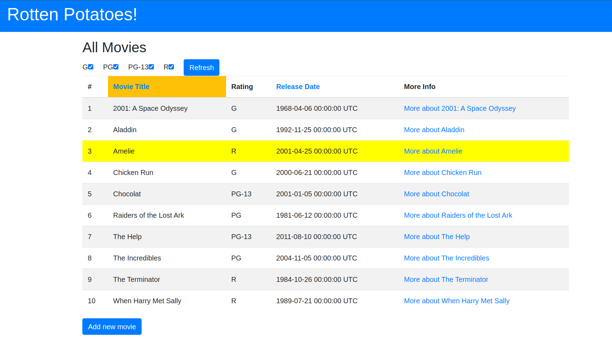

# Pregunta 4

Para este apartado haremos uso del trabajo realizado para la PC3.

- Modifica la vista Index para incluir el número de fila de cada fila en la tabla de películas.
    
Dentro de nuestras vistas, en `index.html.erb`, incluiremos el header `#` para indicar el número de fila. Nuestro table header quedaría como:

```html
<thead>
    <tr>
        <th>#</th>
        <th class="<%= 'hilite bg-warning' if session[:sort] == 'title' %>">
        <%= link_to 'Movie Title', movies_path(sort:'title'), id:'title_header' %>
        </th>
        <th>Rating</th>
        <th class="<%= 'hilite bg-warning' if session[:sort] == 'release_date' %>">
        <%= link_to 'Release Date', movies_path(sort:'release_date'), id:'release_date_header'%>
        </th>
        <th>More Info</th>
    </tr>
</thead>
```
Finalmente, en el cuerpo de nuetra tabla, las iteraciones no solo las haremos con las películas, pero también incluiremos el índice a través de `each_with_index`, luego, nuestra columna de índices quedará como:

```html
<tbody>
    <% @movies.each_with_index do |movie, index| %>
      <tr>
        <td>
          <%= index + 1 %>
        </td>
        <td>
          <%= movie.title %>
        </td>
        ...
    <% end %>
  </tbody>
```

Nuestra aplicación ahora se mostrará de la siguiente manera:



- Modifica la vista Index para que cuando se sitúe el ratón sobre una fila de la tabla, dicha fila cambie temporalmente su color de fondo a amarillo u otro color.

Para realizar ello, le agregaremos una clase `movie-row` en el contenido de nuestra tabla, y al final de nuestra vista, le agregaremos un script para realizar ello.

```html
 <tbody>
    <% @movies.each_with_index do |movie, index| %>
      <tr class="movie-row">
        <td>
          <%= index + 1 %>
        </td>
    ...
```

El script que agregaremos es el siguiente, tenemos un listener sobre nuestro documento, y seleccionará cada fila de nuestra fila de películas, luego tendremos otro listener que verificará si el mouse está encima de dicha fila, si lo está, se cambiará el color del fondo de dicha fila; y si lo quitamos, también quitaremos el color del fondo.

```js
<script>
  document.addEventListener('DOMContentLoaded', function () {
    var rows = document.querySelectorAll('.movie-row');

    rows.forEach(function (row) {
      row.addEventListener('mouseover', function () {
        row.style.backgroundColor = 'yellow';

      row.addEventListener('mouseout', function () {
        row.style.backgroundColor = '';
        });
      });
    });
  })
</script>
```

Finalmente, se muestran los resultados obtenidos:



- Modifica la acción Index del controlador para que devuelva las películas ordenadas alfabéticamente por título, en vez de por fecha de lanzamiento.

Nos dirigimos a nuestro controlador `movies_controller.rb`, y en la acción index realizaremos la siguiente modificación. De la línea de código que teníamos previamente, simplemente agregaremos ```|| 'title```, para que, por predeterminado, se nos ordene por dicho parámetro.

```rb
sort_column = params[:sort] || session[:sort] || 'title'
```

Al entrar a nuestra aplicación, veremos que inmediatamente se mostrará el orden por título.

