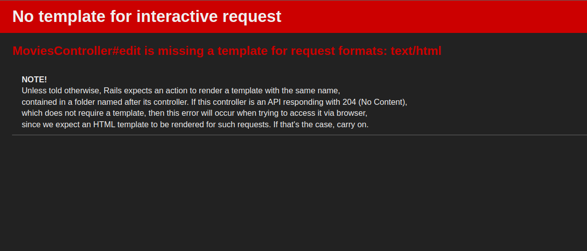

# Pregunta 5

Para resolver esta pregunta, haremos uso de la actividad Rails-Avanzado.

- Extender el código del controlador del código siguiente dado con los métodos edit y update para
las críticas. Usaremos un filtro de controlador para asegurarnos de que un usuario solo puede editar o
actualizar sus propias críticas.

Dado que en nuestro controlador `application_controller.rb`se ha definido `@current_user`, haremos uso de este para crear nuestro filtro. Asimismo, haremos uso del `user_id` de `sessions_controller.rb`. Para ello, agregaremos un nuevo método en nuestro controlador, el cual hará uso del filtro que se ha pedido y comprobará si tenemos dicho `current_user`, y si es el mismo que el `user_id`. Si no lo son, nos lanzará un mensaje de error y se nos rediccionará.

```rb
def authorize_user!
    unless @current_user && @current_user == @user_id
      flash[:alert] = "Not authorized to edit."
      redirect_to movies_path
    end
  end
```

Y tanto en el método `edit` como `update`, agregaremos como primera línea lo siguiente: `authorize_user!`.
Finalmente, cuando queremos ejecutar nuestra aplicación, se nos mostrará lo siguiente cuando queremos editar:


Pero esto no significa un error en la lógica, esto indica que hemos tenido acceso a editar, pero aún no hemos implementado una plantilla para ello.

