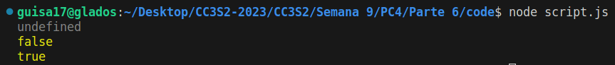

# Pregunta 6

Para esta pregunta haremos uso del ćodigo realizado para la actividad JavaScript.

1. Un inconveniente de la herencia de prototipos es que todos los atributos (propiedades) de los objetos son públicos. Sin embargo, podemos aprovechar las clausuras para obtener atributos privados. Crea un sencillo constructor para los objetos User que acepte un nombre de usuario y una contraseña, y proporcione un método checkPassword que indique si la contraseña proporcionada es correcta, pero que deniegue la inspección de la contraseña en sí. Esta expresión de “sólo métodos de acceso” se usa ampliamente en jQuery. Sugerencia: El constructor debe devolver un objeto en el que una de sus propiedades es una función que aprovecha las clausuras de JavaScript para ‘recordar’ la contraseña proporcionada inicialmente al constructor. El objeto devuelto no debería tener ninguna propiedad que contenga la contraseña.

Empezaremos creando nuestra función `createUser` con parámetros `user` y `password`. Donde guardaremos nuestra contraseña como un atributo privado a través de otra variable. Para ello, por convención se usa el mismo nombre, pero con `_` como prefijo.

```js
function createUser(user, password) {
    _password = password
}
```
Seguidamente, crearemos nuestro método `checkPassword`, que verificará si la contraseña que hemos ingresado, es igual a la que hemos almacenado en la variable `pswd`.

```js
function checkPassword(input) {
    return input == _password;
}
```

Finalmente, nuestro constructor devolverá tanto el usuario como nuestro método `checkPassword`, mas no, alguna asociación directa de la contraseña en sí.

```js
return {
    user: user,
    checkPassword: checkPassword
};
```

Agregando algunos casos de ejemplo:
```js
var user = createUser('Guillermo', 'contraseña123');
console.log(user._password); // Intentamos acceder
console.log(user.checkPassword('contraseña'));
console.log(user.checkPassword('contraseña123'));
```

Obtendremos los siguientes resultados:



2. Extienda la función de validación en ActiveModel para generar automáticamente código JavaScript que valide las entradas del formulario antes de que sea enviado. Por ejemplo, puesto que el modelo Movie de RottenPotatoes requiere que el título de cada película sea distinto de la cadena vacía, el código JavaScript deberías evitar que el formulario “Add New Movie” se enviara si no se cumplen los criterios de validación, mostrar un mensaje de ayuda al usuario, y resaltar el(los) campo(s) del formulario que ocasionaron los problemas de validación. Gestiona, al menos,las validaciones integradas, como que los títulos sean distintos de cadena vacía, que las longitudes máximas y mínima de la cadena de caracteres sean correctas, que los valores numéricos estén dentro de los límites de los rangos, y para puntos adicionales, realiza las validaciones basándose en expresiones regulares.

