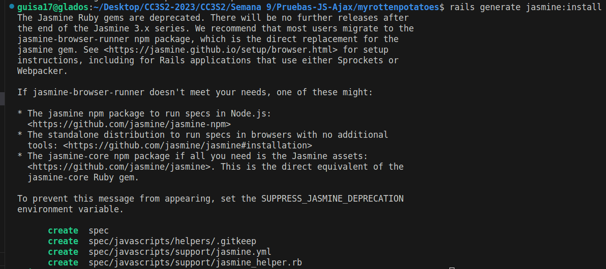

# Testing JavaScript y AJAX

- Guillermo Ronie Salcedo Alvarez - 20210164D

Empezaremos con el uso de `Jasmine` insertando `gem "jasmine"` en nuestro Gemfile, y volvemos a ejecutar `bundle`. Luego, ejecutamos los siguientes comandos:

```bash
rails generate jasmine:install 
mkdir spec/javascripts/fixtures 
curl https://raw.githubusercontent.com/velesin/jasmine-jquery/master/lib/jasmine-jquery.js
    > spec/javascripts/helpers/jasmine-jquery.js 
git add spec/javascripts 
```




