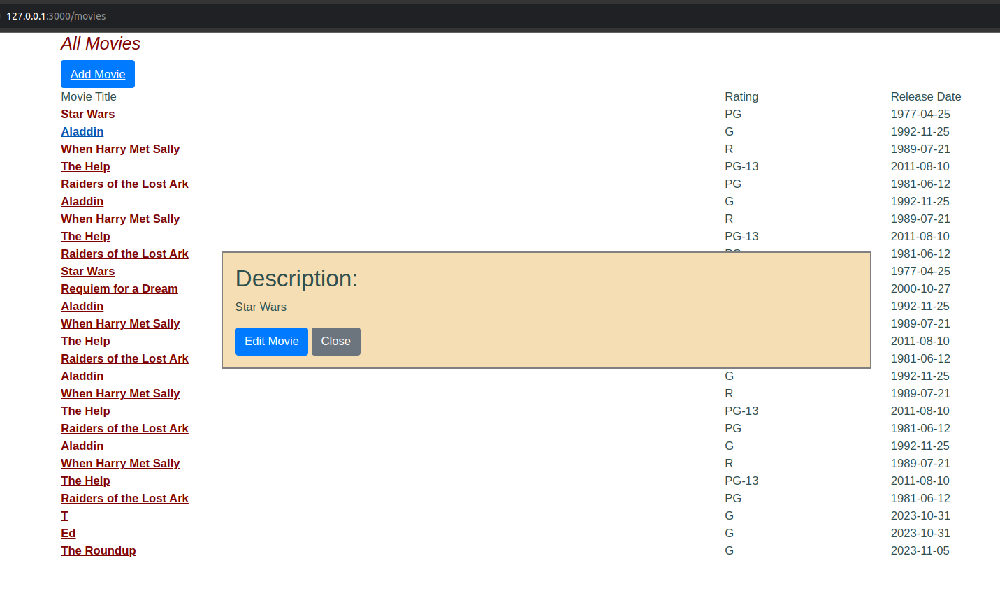

# Testing JavaScript y AJAX

- Guillermo Ronie Salcedo Alvarez - 20210164D

Empezaremos con el uso de `Jasmine` insertando `gem "jasmine"` en nuestro Gemfile, y volvemos a ejecutar `bundle`. Luego, ejecutamos los siguientes comandos:

```bash
rails generate jasmine:install 
mkdir spec/javascripts/fixtures 
git add spec/javascripts 
```


Una vez realizado esto, pasaremos a crear nuestro archivo `basic_check_spec.js`, en donde incluiremos el siguiente código:

```js
describe ('Jasmine basic check', function() { 
    it('works', function() { expect(true).toBe(true); }); 
});
```

Luego, ejecutaremos el comando `rake jasmine` para realizar las pruebas Jasmine respectivas. Nos mostrará qué tenemos una prueba spec, así como el mensaje que hemos definido en el código anterior.


**¿Cuáles son los problemas que se tiene cuando se debe probar Ajax?**

Los problemas que se tiene al probar Ajax es la naturaleza de la misma, dada que es asincrónico, esto quiere decir que las pruebas deberán manejar la respuesta después de que se haya completado la solicitud. Asimismo, surgen otros problemas como la dependencia que tiene Ajax con el servidor, si el servidor no responde, las pruebas pueden fallar o haber retrasos en el tiempo de respuesta.


**¿Qué son los stubs, espias y fixture en Jasmine para realizar pruebas de Ajax?**

- Los stubs son funcionas que reemplazan a las funciones reales durante las pruebas, puede simular el comportamiento de la función original y devolver resultados predefinidos.
- Los espías son funciones que pueden rastrear llamadas a funciones y verificar cómo se han realizado; por ejemplo, en Ajax, se asegura de que se haya llamado con los parámetros correctos.
- Los fixtures son datos de pruebas que se utilizan para simular la respuesta del servidor, estos pueden ser un conjunto de datos simulados esperados como respuestas a una llamada Ajax.


En Jasmine, la estructura de casos de prueba sigue el estilo de RSpec. Se utilizan las funciones `describe` e `it` para organizar pruebas. A diferencia de Ruby, en JavaScript, estos bloques se definen mediante funciones anónimas sin argumentos, proporcionando una estructura clara y anidada para especificar conjuntos y casos de prueba.


Experimenta el siguiente código de especificaciones (specs) de Jasmine del camino feliz del código AJAX llamado `movie_popup_spec.js`.

```js
describe('MoviePopup', function() {
  describe('setup', function() {
    it('adds popup Div to main page', function() {
      expect($('#movieInfo')).toExist();
    });
    it('hides the popup Div', function() {
      expect($('#movieInfo')).toBeHidden();
    });
  });
  describe('clicking on movie link', function() {
    beforeEach(function() { loadFixtures('movie_row.html'); });
    it('calls correct URL', function() {
      spyOn($, 'ajax');
      $('#movies a').trigger('click');
      expect($.ajax.calls.mostRecent().args[0]['url']).toEqual('/movies/1');
    });
    describe('when successful server call', function() {
      beforeEach(function() {
        let htmlResponse = readFixtures('movie_info.html');
        spyOn($, 'ajax').and.callFake(function(ajaxArgs) { 
          ajaxArgs.success(htmlResponse, '200');
        });
        $('#movies a').trigger('click');
      });
      it('makes #movieInfo visible', function() {
        expect($('#movieInfo')).toBeVisible();
      });
      it('places movie title in #movieInfo', function() {
        expect($('#movieInfo').text()).toContain('Casablanca');
      });
    });
  });
});
```

Una vez ejecutado, se nos mostrará la siguiente ventana:


En donde, todas nuestras pruebas han fallado debido a un `ReferenceError`, en donde las funciones y objetos que estamos utilizando en el script de prueba Jasmine no están definidos. Para nuestro caso, no se han cargado dependencias necesarias como `Jasmine-jQuery` y `jQuery`.


**¿Que hacen las siguientes líneas del código anterior?. ¿Cuál es el papel de spyOn de Jasmine y los stubs en el código dado?**

```js
it('calls correct URL', function() {
      spyOn($, 'ajax');
      $('#movies a').trigger('click');
      expect($.ajax.calls.mostRecent().args[0]['url']).toEqual('/movies/1');
    });
```

Las siguientes líneas nos verifican si al hacer click sobre el enlace de una película, se realice la solicitud Ajax con una URL `'movies/1'`. El papel que cumple `spyOn` en Jasmine es espiar funciones y rastrear su comportamiento. Para nuestro caso, espiaremos a `$.ajax`, con lo que podremos verificar cómo se utiliza y qué argumentos recibe. Por otro lado, en cuanto a `stubs`, haremos uso de él por medio de `and.callFake` que nos permite simular el comportamiento de `$.ajax` durante la prueba.


**¿Qué hacen las siguientes líneas del código anterior?**

```js
 let htmlResponse = readFixtures('movie_info.html');
        spyOn($, 'ajax').and.callFake(function(ajaxArgs) { 
          ajaxArgs.success(htmlResponse, '200');
        });
        $('#movies a').trigger('click');
      });
      it('makes #movieInfo visible', function() {
        expect($('#movieInfo')).toBeVisible();
      });
      it('places movie title in #movieInfo', function() {
        expect($('#movieInfo').text()).toContain('Casablanca');
```

Las siguientes líneas simulan una llamada exitosa al hacer click en un enlace de una película por medio de un comportamiento falso para la función `$.ajax` que devuelve datos simulados. Primero, cargamos un fixture `movie_info.html` en la variable `htmlResponse` que simulará la respuesta del servidor. Seguidamente, se espía la función `$.ajax` para simular una llamada exitosa `add.callFake`. Luego, se simula el hacer click sobre el enlace de la película, y verificamos si al dar click, el id `#movieInfo` sea visible y contiene la cadena `Casablanca`.


**Dado que Jasmine carga todos los ficheros JavaScript antes de ejecutar ningún ejemplo, la llamada a setup (línea 34 del codigo siguiente llamado movie_popup.js)ocurre antes de que se ejecuten nuestras pruebas, comprueba que dicha función hace su trabajo y muestra los resultados.**

```js
var MoviePopup = {
  setup: function() {
    // add hidden 'div' to end of page to display popup:
    let popupDiv = $('<div id="movieInfo"></div>');
    popupDiv.hide().appendTo($('body'));
    $(document).on('click', '#movies a', MoviePopup.getMovieInfo);
  }
  ,getMovieInfo: function() {
    $.ajax({type: 'GET',
            url: $(this).attr('href'),
            timeout: 5000,
            success: MoviePopup.showMovieInfo,
            error: function(xhrObj, textStatus, exception) { alert('Error!'); }
            // 'success' and 'error' functions will be passed 3 args
           });
    return(false);
  }
  ,showMovieInfo: function(data, requestStatus, xhrObject) {
    // center a floater 1/2 as wide and 1/4 as tall as screen
    let oneFourth = Math.ceil($(window).width() / 4);
    $('#movieInfo').
      css({'left': oneFourth,  'width': 2*oneFourth, 'top': 250}).
      html(data).
      show();
    // make the Close link in the hidden element work
    $('#closeLink').click(MoviePopup.hideMovieInfo);
    return(false);  // prevent default link action
  }
  ,hideMovieInfo: function() {
    $('#movieInfo').hide();
    return(false);
  }
};
$(MoviePopup.setup);
```

La función `setup` en el archivo anterior `movie_popup.js` permite crear el entorno para la funcionalidad popup. Se nos añade el id `#movieInfo` al final de la página, se oculta, y se establece el manejador de enlaces `#movies a`. Luego, la función `getMovieInfo` se encargará de realizar la solcitud Ajax al hacer click sobre el enlace y, finalmente, se mostrará la información en un recuadro.




**Indica cuales son los stubs y fixtures disponibles en Jasmine y Jasmine-jQuery.**

En Jasmine, los stubs puede usar el método `spyOn` para crear que stub que rastree llamadas a una función y permita especificar un comportamiento falso usando `add.callFake` o `add.returnValue`. Por otro lado, el concepto de `fixtures` en Jasmine-jQuery hace referencia a un conjunto de datos de prueba que se utilizan para simular el entorno de prueba. Se nos proporciona funciones para cargar y manipular fixtures en las pruebas `loadFixtures` y `readFixtures`.


**Como en RSpec, Jasmine permite ejecutar código de inicialización y desmantelamiento de pruebas utilizando beforeEach y afterEach. El código de inicialización carga el fixture HTML mostrado en el código siguiente, para imitar el entorno que el manejador getMovieInfo vería si fuera llamado después de mostrar la lista de películas.**

```js
<div id="movies">
  <div class="row">
    <div class="col-8"><a href="/movies/1">Casablanca</a></div>
    <div class="col-2">PG</div>
    <div class="col-2">1943-01-23</div>
  </div>
</div>
```

En Jasmine, usamos la función `loadFixtures` para cargar el fixture anterior, imitando el manejador `getMovieInfo` que observaría después de mostrar la lista de películas. Durante las pruebas, estos fixtures se cargarán dentro de `div#jasmine-fixtures` ubicado en `div#jasmine_content`. Luego de cada prueba, se podrá usar `afterEach` para realizar la limpieza necesaria, manteniendo la independecia de las pruebas.


## Ejercicios

1. **Inconveniente en la herencia de prototipos.**
Para aprovechar las clausuras y lograr atributos privados, creamos un constructor de objetos `User` en JavaScript que acepte un nombre de usuario y una contraseña. Luego, proporcionamos el método `checkPassword` para verificar si la contraseña proporcionada es correcta, mientras mantienes la contraseña como un atributo privado.

    ```js
    function User(username, password) {
      let _password = password;

      this.checkPassword = function(inputPassword) {
        return _password === inputPassword;
      };
    }
    ```


2. **Identificación de filas que estás ocultas.**
Supongamos que las filas ocultas en la tabla `movies` no pueden ser modificadas en el servidor. Podemos identificar las filas ocultas usando solo JavaScript del lado del cliente mediante el siguiente código, en donde se aprovecha la propiedad `hidden` en HTML.

    ```js
    let filasOcultas = document.querySelectorAll('#movies .row[hidden]');
    ```


3. **Menú cascada en Ajax.**
El siguiente código AJAX asume una estructura básica para el menú cascada

    ```js
    $('#menuA').change(function() {
      var selectedOptionA = $(this).val();

      // Solicitud AJAX para opción B
      $.ajax({
        url: '/modelA/' + selectedOptionA + '/modelB_options',
        method: 'GET',
        success: function(optionsB) {
          $('#menuB').empty();
          optionsB.forEach(function(optionB) {
            $('#menuB').append($('<option>', { value: optionB.id, text: optionB.name }));
          });
        },
        error: function() {
          console.error('Error al obtener las opciones de B.');
        }
      });
    });
    ```

4. **Validación de entradas del formulario antes de que sea enviado.**
Extenderemos la función de validación en ActiveModel para generar automáticamente código JavaScript que valide las entradas del formulario antes del envío. A continuación, se muestra un ejemplo básico utilizando jQuery:

    Primero, definimos las validaciones en nuestro modelo `Movie`:
    ```rb
    # app/models/movie.rb
    class Movie < ApplicationRecord
      validates :title, presence: true, uniqueness: true
      validates :length, numericality: { greater_than: 0 }
    end
    ```

    Luego, tendremos el siguiente código de JavaScript:
    ```js
    document.getElementById('formMovie').addEventListener('submit', function(event) {
      if (document.getElementById('movie_title').value === '') {
        alert('El título no es válido.');
        event.preventDefault();
        return;
      }
      // Validaciones adicionales
    });
    ```
